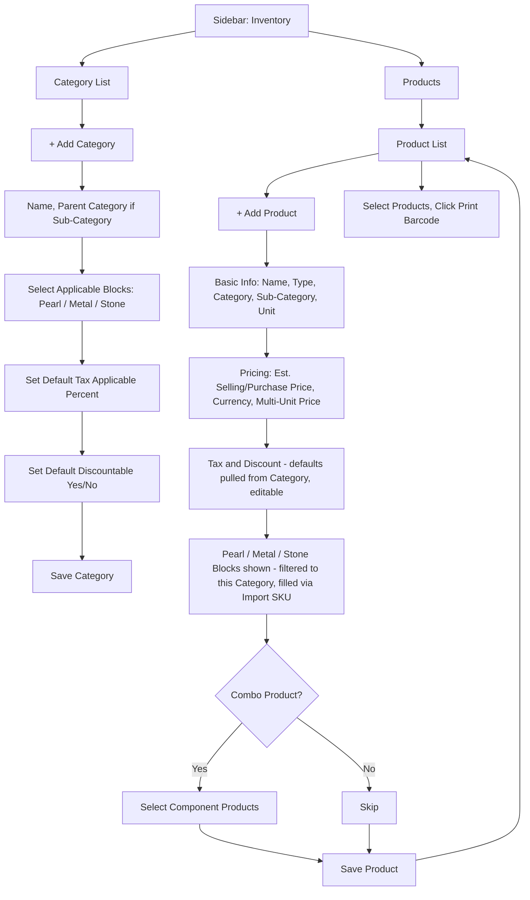

# CountIt — Product Management: UI Flow & Behavior

**Purpose of this document:** Show how a product gets set up in CountIt — every feature block that makes up "Product Management," how they connect, and what's missing. Meant to be walked through with the client to confirm the product model matches how they actually catalog jewellery.

**Source verified against:** CountIt Backend Specification (Product Management section), the current frontend audit, and the client's own product category list (`product.xlsx`).

---

## 1. What the Spec Requires (Baseline)

- Every product needs a **unique SKU** and a set of **attributes**.
- **Different SKU logic** for Virtual vs. Physical, and Raw Material vs. Finished Good.
- Every product marks **Taxable / Not Taxable**, with a **Tax %**.
- Every product marks **Discount Applicable (Yes/No)**.
- Attributes are not one flat list — they break down into **Pearl, Metal (Gold/Silver), and Stone** detail blocks, each with its own fields. See Section 2.8 for the full model.

> **Important distinction confirmed by the client:** every category in this module (Pearl Necklace, Ring, Earrings, etc.) is a **finished good**. Nothing in Product Management is a raw material by itself — raw materials (loose pearls, gold, silver, gemstones) are purchased and tracked separately, then turned into these finished products through a production process. Full detail is in the **Production** document; it's noted here because it changes what "attributes" means for a product in this module (see 2.8).

---

## 2. Module Breakdown

Product Management is not one single form — it's a set of distinct feature blocks. Each is documented separately below so it's clear what belongs where.

| # | Feature Block | What It Covers |
|---|---|---|
| 2.1 | Basic Information | Name, SKU, product type, category/sub-category, unit(s) |
| 2.2 | Pricing & Currency | Estimated selling price, estimated purchase price, multi-unit pricing, currency |
| 2.3 | SKU & Barcode | Unique SKU generation, barcode printing |
| 2.4 | Tax Information | Taxable flag, tax % |
| 2.5 | Discount Information | Discountable flag |
| 2.6 | Combo Product | Bundling multiple sellable products into one SKU |
| 2.7 | Category & Sub-Category Setup | Category hierarchy, category-level tax/discount defaults, attribute assignment |
| 2.8 | Attributes | Pearl / Metal / Stone attribute blocks, each auto-filled via Import SKU |

---

### 2.1 Basic Information

- Product Name
- SKU (auto-suggested, editable — see 2.3)
- Product Type: Virtual / Physical / Raw Material / Finished Good
- Category (required) and **Sub-Category (required)** — every category must support child sub-categories, not just a flat list
- Unit — see 2.2 for how multiple units apply

### 2.2 Pricing & Currency

- **Estimated Selling Price** and **Estimated Purchase Price** — called "estimated" deliberately, because the real, final price is confirmed later at the point of purchase (see Remark below).
- **Multiple Units, Priced per Unit** — a product may be sold or purchased in more than one unit (e.g., grams, pieces, boxes). Each unit needs its own price and a conversion rate back to the base unit (this reuses the existing Unit Conversion screen at `/unit-conversion`).
- **Currency of the Product Price** — a dropdown on the product so its listed price is tied to a specific currency, which matters once Multi-Currency is enabled.

> **Remark to capture directly on this screen:** *"This price is an estimate. The actual price for a specific batch is confirmed and becomes editable during the Purchase process."* This should appear as inline helper text under the Purchase Price field so it's never mistaken for a locked, final number.

### 2.3 SKU & Barcode

- SKU is generated automatically using the pattern `[Type Prefix]-[Category Code]-[Random Number]`, but remains editable.
- Uniqueness is validated on save.
- **Print Barcode from the Product List** — the Product List gets a new action: select one or more products → **Print Barcode** → opens the Label Printing screen with those products pre-loaded, instead of requiring a user to open each product individually first.

### 2.4 Tax Information

- Taxable toggle (Yes/No).
- If Yes, a Tax % field and Tax Type appear (e.g., VAT, Labour Tax).
- This can be **pre-filled from the category's default** (see 2.7) but remains editable per product.

### 2.5 Discount Information

- Discountable toggle (Yes/No) — controls whether this specific product can ever have a discount applied at the point of sale.
- Same as Tax, this can inherit a default from the category (see 2.7).

### 2.6 Combo Product

- A Combo Product is a **bundle of multiple existing, independently sellable products**, packaged and sold under one new SKU (e.g., a boxed gift set of earrings + a pendant).
- This is different from "Composition" in the Production module — Composition describes what raw materials make up *one manufactured item*; Combo Product bundles *finished, already-sellable items* together for sale.
- Form addition: a **"Combo Product"** toggle on Product Create; when enabled, an "Add Component Product" picker appears to select which existing products (and quantities) make up the combo.

### 2.7 Category & Sub-Category Setup

- Category List must support a **parent → sub-category** structure (e.g., Category: *Necklace* → Sub-Categories: *Pearl Necklace, Diamond Necklace, Beaded Necklace*).
- **Category-level defaults:** when creating or editing a category, it should carry its own:
  - **Discountable (Yes/No)**
  - **Tax Applicable (Yes/No) and Tax %**
  
  These act as the default values applied to every new product created under that category — saving repetitive entry, while still letting an individual product override them.
- **Attribute Assignment at Category Level:** while creating a category, the form must let the user **select which attribute blocks apply to that category** — Pearl, Metal (Gold/Silver), and/or Stone (e.g., a Chain category may only need Metal; a Pearl Necklace needs Pearl and possibly Stone). See the category-to-block mapping in Section 2.8, and the Attribute Management screen it depends on.

### 2.8 Attributes — Pearl / Metal / Stone Blocks

The client's own product-attribute reference confirms that jewellery attributes aren't one flat list — they split into three distinct blocks, and a product can use one, two, or all three depending on its category:

| Block | Can Repeat on One Product? | Fields | Notes |
|---|---|---|---|
| **Pearl** | Yes (multiple pearls per item) | Import SKU (auto-fills all pearl details); **Strand** (Single / 2 Strand / 3 Strand / 4 Strand / 5 Strand / Choker) and **Length** (16in / 17–18in / 21–22in / 26in / 33in) — both **Pearl Necklace only** | Applies to any pearl-bearing category |
| **Metal** | No (one metal specification per item, typically) | Import SKU; Color (gold only); Karat; Weight (grams) | Applies to any category using gold or silver |
| **Stone** | Yes (multiple stones per item) | Import SKU (auto-fills Stone Type, Color, Clarity for diamonds); Stone Type; Shape; Weight; Carat; Color (diamond only); Clarity (diamond only) | Applies to any category using gemstones or diamonds |

**Import SKU (IMP_SKU):** every raw material batch purchased carries an Import SKU that auto-fills its details wherever it's referenced — a product's attribute fields are populated by selecting the Import SKU(s) used to make it, rather than typing attribute values from scratch each time. This is the same Import SKU used in Production to determine which raw-material batch to deduct from (see the Production document, Section 8).

**Category-to-Block Mapping (confirmed from the client's reference table):**

| Category | Pearl | Metal | Stone |
|---|:---:|:---:|:---:|
| Mangalsutra | ✅ | ✅ (Gold) | ✅ |
| Pearl Necklace | ✅ | ✅ (Gold + Silver) | ✅ |
| Necklace | ✅ | ✅ (Gold + Silver) | ✅ |
| Pendant | ✅ | ✅ (Gold + Silver) | ✅ |
| Brooch | ✅ | ✅ (Gold + Silver) | ✅ |
| Bangle | ✅ | ✅ (Gold + Silver) | ✅ |
| Noor | ✅ | ✅ (Gold + Silver) | ✅ |
| Earring | ✅ | ✅ (Gold + Silver) | ✅ |
| Ear Stud | ✅ | ✅ (Gold + Silver) | — |
| Nose Pin | *unclear — see below* | *unclear* | *unclear* |
| Ring | ✅ | ✅ (Gold + Silver) | ✅ |

> **Flag for the client:** the source reference table left every column blank for **Nose Pin**, which could mean it genuinely uses none of these three blocks, or that its row was simply left incomplete in the sheet. This needs to be confirmed directly rather than assumed either way, since a Nose Pin almost certainly uses at least a Metal block in practice.

- A new **Attribute Management** screen is needed as a prerequisite: a master list where the Pearl, Metal, and Stone blocks — and their internal dropdown values (Stone Type options, Strand options, etc.) — are defined once, and Import SKUs are linked to the correct block values on purchase.
- Once this exists, Category Setup (2.7) lets a user pick which of these three blocks apply to a given category (using the mapping table above as the default, editable), and Product Create/Edit shows only the relevant block(s) for the product's category.

---

## 3. Real Category Data (From Client's Product Sheet)

Confirmed directly from the client's own spreadsheet — these are the actual categories/collections in use today. As noted in Section 1, **every one of these is a finished good** — the end result of a production process, not a raw material:

**Product Categories (finished goods):** Pearl Necklace, Ear Studs, Ear Drop, Earrings, Necklace, Pendant, Brooch, Chain, Ring, Nose Pin, Polki, Silver Ware

**Collections (a second grouping layer, separate from Category):** Pearls, Mangalsutra, KN Silver, Noor Mahal Polki Collection, Lifestyle Products, Colored Gemstones, Magic Bar, Zodiac Collection, KN Juniors, Everyday Chic Diamonds, Charmed Life, Engagement Rings, Laligurans, Symbols & Good Luck

> **Confirm with client:** since Category now also requires Sub-Categories (Section 2.7), is "Collection" meant to be the same thing as Sub-Category, or a third, independent grouping used for merchandising/marketing rather than product structure?

---

## 4. Screens Involved

| Screen | Route | Status |
|---|---|---|
| Category List | `/category-list` | 🟡 Needs sub-category support + attribute assignment + tax/discount defaults |
| Category Create/Edit | `/category/create` | 🟡 Same as above |
| Product List | `/menu-item` | 🟡 Needs attribute filters + "Print Barcode" bulk action |
| Product Create/Edit | `/menu-item/create` | 🟡 Needs Combo Product, Currency, multi-unit pricing, category-linked defaults |
| Bulk Price Editor | `/menu-item/bulk-price-editor` | ✅ Working |
| Attribute Management | *(new)* | ⚫ Not started — required before 2.7 and 2.8 can work (defines the Pearl/Metal/Stone block values and links Import SKUs to them) |

---

## 5. Step-by-Step UI Flow

---

## 6. Purchase-Time Consideration (Brief — Full Detail in Purchase Document)

One open question directly affects this module but is really a **Purchase Management** decision: since products are made from raw materials (Pearl, Metal, Stone — see Section 1), and each raw material batch is meant to carry its own Import SKU (Section 2.8), what happens when the same *type* of raw material is purchased again but with a slightly different attribute value (e.g., a different pearl shade or size on this shipment)?

- **Approach A — reuse an existing raw material entry, override attributes per batch at purchase time.**
- **Approach B — treat each shipment as its own Import SKU** with its own attribute values, which is what the Import SKU model in Production already implies.

This is covered in full in the **Purchase Management** document (Section 6, "Same Raw Material, Different Attributes") since it's a purchase-flow decision, not a product-setup one — flagging it here only so the connection between the two modules is visible.

---

## 7. Role Visibility

| Action | Org Admin | Internal Finance | Store Manager | Sales Team |
|---|---|---|---|---|
| View Product List | ✅ | ✅ | ✅ | ✅ (no cost) |
| Create/Edit Product | ✅ | ✅ | ✅ | ✅ (no cost) |
| See Purchase Price field | ✅ | ✅ | ❌ | ❌ |
| Manage Categories / Sub-Categories | ✅ | ✅ | ✅ | ❌ |
| Manage Attribute Master | ✅ | ✅ | ✅ | ❌ |
| Print Barcode | ✅ | ✅ | ✅ | ❌ |

---

## 8. What's Confirmed vs. What Needs the Client's Answer

**Confirmed and working today:** basic product creation, category creation (flat), pricing, tax toggle, discount flag, bulk price editing.

**Needs a decision:**
- Is "Collection" the same as "Sub-Category," or a separate marketing-level grouping? (Section 3)
- Should every product under a category automatically inherit that category's Tax %/Discountable setting, or should the product form always require explicit confirmation? (Section 2.7)
- Does Nose Pin genuinely use none of the Pearl/Metal/Stone blocks, or was its row simply left incomplete in the source sheet? (Section 2.8)
- Does the Import SKU description under "Metal" really pull Stone Type/Clarity, or should it pull Color/Karat/Weight as its own fields suggest? (Section 2.8 — same question raised in the Production document)
- Same raw material, different attribute at purchase time — see the dedicated question in the Purchase Management document (Section 6).

---

**Document status:** Ready for client walkthrough.
**Next step:** Build Attribute Management first (Section 2.8), since Category Setup and Product Create both depend on it.
