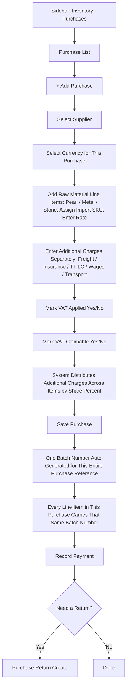

# CountIt — Purchase Management: UI Flow & Behavior

**Purpose of this document:** Show how buying stock from a supplier works in CountIt — supplier selection, additional charges, tax handling, currency, and batch number generation — so the client can confirm the cost and batch logic matches how they actually import and receive jewellery.

**Source verified against:** CountIt Backend Specification (Purchase Management section) and the current frontend audit.

---

## 1. What the Spec Requires

- **What gets purchased is raw material** — Pearl, Metal (Gold/Silver), and Stone — not a finished product directly. Finished products (Necklace, Ring, Earrings, etc.) only exist after a production job converts these raw materials — see the Production document. The one exception is **Buy-Back** (Section 7), where an already-sold finished item is purchased back from a customer.
- Items can be purchased as **Virtual** or **Physical**.
- Each purchase batch can carry its own rate.
- **Additional charges must be added separately**, not lumped into one number — e.g., Freight, Insurance, TT/LC Import charges, Wages, Transportation, each as its own line.
- These additional charges are **distributed across every item** in the bill, based on each item's share % of the total bill cost.
- A purchase can specify its **transaction currency**.
- Each purchase must be able to mark whether **VAT is applied**, and separately, whether that VAT is **claimable** (i.e., can be used as an input tax credit).
- A **single Batch Number is generated per Purchase Reference** — every raw material line item bought under the same purchase bill shares that one batch number (this is different from giving each line item its own separate batch number).
- The business does **buy-back** — repurchasing a previously sold item at a percentage deduction.
- The business can buy items/product from individuals/supplier.

---

## 2. Screens That Exist Today

| Screen | Route | Status |
|---|---|---|
| Purchase List | `/purchase` | 🟡 Working, no landed-cost breakdown visible yet |
| Purchase Create/Edit | `/purchase/create` | 🟡 Basic line items work; charges, currency, VAT-claimable, and batch logic below still need to be added |
| Purchase Detail | `/purchase/detail/:id` | ✅ Working |
| Purchase Return List / Create / Detail | `/purchase-returns` | ✅ Working |
| Supplier List / Detail | `/suppliers` | ✅ Working — every purchase is linked here |

---

## 3. Step-by-Step UI Flow

### Walkthrough in plain language

1. **Purchase List (`/purchase`)** — table of every purchase bill: Bill No, Supplier, Date, Items, Total Amount, Payment Status.
2. **Click `+`** — opens Purchase Create.
3. **Select Supplier**, then **select the Currency** this purchase is being transacted in (relevant once Multi-Currency is enabled — see the Multi-Currency module for conversion rules).
4. **Add raw material line items** — search or select by type (Pearl, Metal, or Stone), assign each line item an **Import SKU** (see Section 6 for what this means and why), and enter the quantity and rate for that line.
5. **Enter additional charges as separate line items** — not one combined "extra cost" box. Each of the following gets its own input: Freight, Insurance, TT/LC Import Charges, Wages, Transportation (and any other cost the business wants to add).
6. **Mark VAT** — two separate toggles:
   - **VAT Applied (Yes/No)** — does this purchase attract VAT at all?
   - **VAT Claimable (Yes/No)** — if VAT is applied, can it be claimed back as an input credit? (These are asked separately because a purchase can have VAT applied but not be claimable, depending on the supplier or goods type.)
7. **Cost distribution** — the system takes the total of all additional charges and spreads it across every line item, proportional to each item's share of the total bill value.
8. **Save.** At this point:
   - **One Batch Number is generated for the whole purchase reference** — this is the important correction from earlier drafts of this document. It is **not** one batch number per product line item; every item bought on this single purchase bill shares the same batch number.
   - That shared batch number carries forward into Inventory for every item on the bill.
9. **Record Payment** and, if needed, **Create Purchase Return** from the row actions — pre-linked to this bill, with the amount auto-suggested from the bill (or entered manually if there's no bill to reference).

---

## 4. Additional Charges — Detail

| Charge Type | Entered As | Distributed To Items? |
|---|---|---|
| Freight | Separate line, one value for the whole bill | ✅ Yes, by item's share % of total bill value |
| Insurance | Separate line | ✅ Yes |
| TT/LC Import Charges | Separate line | ✅ Yes |
| Wages | Separate line | ✅ Yes |
| Transportation | Separate line | ✅ Yes |
| Other (business-defined) | Separate line, addable as needed | ✅ Yes |

Each item's final **landed cost** = its own purchase rate + its proportional share of every additional charge above.

---

## 5. Batch Number Logic — Why This Matters

**Old assumption (corrected):** each product line item gets its own unique batch number.
**Correct behavior:** the **Purchase Reference itself** generates **one** batch number, and every product bought under that reference shares it.

**Practical effect:** if a single purchase bill brings in 3 different products, all 3 will show the same batch number in Inventory, distinguishing them from products of the same SKU bought on a different purchase bill. Inventory reports and Sales Billing's batch-selection screen both need to reflect this — a batch is tied to "this specific purchase event," not to "this specific product."

---

## 6. Same Raw Material, Different Attributes — Needs Client Clarification

**The scenario:** the business buys the same raw material type again (e.g., pearls of roughly the same kind), but this shipment's actual attribute values are slightly different from the last one (a different shade, size, or quality grade).

**Where this connects to Import SKU:** per the Production document, every raw material batch purchased is meant to carry its own **Import SKU**, which auto-fills that specific batch's attribute details wherever it's used. This already points toward one clear answer:

**Approach B (aligned with the Import SKU model) — each purchase gets its own Import SKU.** Every time raw material comes in, it's entered as its own Import SKU with its own attribute values (color, size, quality, etc.), regardless of whether a similar-looking material was purchased before. There's no need to "match" it to a prior entry — Purchase Create just captures what this shipment's attributes actually are, and that becomes the reference used later in Product and Production screens to know exactly which batch is which.

**Approach A (the alternative) — reuse an existing raw material entry, override attributes per batch.** If the client would rather maintain one ongoing "master" entry per raw material type (e.g., one general "Lavender Pearl" entry) and only adjust specific attribute values at the point of purchase when a batch differs, that's also possible, but it works against the Import-SKU-per-batch model described in Production and would need that model adjusted to match.

**The practical trade-off:** Approach B (one Import SKU per shipment) is simpler and matches what's already described in the Production document — every batch is naturally distinct. Approach A is more familiar if the client thinks in terms of "the same raw material, occasionally different," but requires extra logic to decide when a new Import SKU is truly needed versus when to reuse an existing one.

> **This is the same question noted briefly in the Product Management document (framed there as "same product, different attribute") — it lives here in full because it is a purchase-time decision. Recommend confirming Approach B as the default, since it's consistent with the Import SKU behavior already described in Production, unless the client specifically wants Approach A.**

---

## 7. Buy-Back

Buy-back is repurchasing an item already sold to a customer, at a deduction from the original price.

**Current state:** not yet its own screen or mode. Two realistic options:
- A "Buy-Back" toggle/mode on this Purchase Create form (tied to a customer instead of a supplier), **or**
- A mode on the Sales Return screen instead.

> **Confirm with client:** which of the two matches how buy-back is handled operationally.

---

## 8. Role Visibility

| Action | Org Admin | Internal Finance | Store Manager | Sales Team |
|---|---|---|---|---|
| View Purchases | ✅ | ✅ | ✅ | ❌ |
| Create/Edit Purchases | ✅ | ✅ | ❌ | ❌ |
| View Landed Cost | ✅ | ✅ | ❌ | ❌ |
| Mark VAT Applied/Claimable | ✅ | ✅ | ❌ | ❌ |
| Create Purchase Return | ✅ | ✅ | ❌ | ❌ |
| Record Supplier Payment | ✅ | ✅ | ❌ | ❌ |

---

## 9. What's Confirmed vs. What Needs the Client's Answer

**Confirmed and working today:** supplier selection, per-line rate entry, purchase returns (with and without a bill reference).

**Needs a decision:**
- Same raw material, different attribute at purchase time — see Section 6 (recommend confirming Approach B, consistent with the Production document's Import SKU model).
- Buy-back: purchase-side flow or sales-return-side flow? (Section 7)
- Will "VAT Claimable" ever need to be a partial percentage (e.g., only 50% claimable) rather than a strict Yes/No?

---

**Document status:** Ready for client walkthrough.
**Next step:** Confirm Section 6 (same raw material, different attributes) first — it affects this form, the Product Management attribute model, and Production's Import SKU logic — then build the additional-charges and batch-number logic described above into the existing Purchase Create screen.
