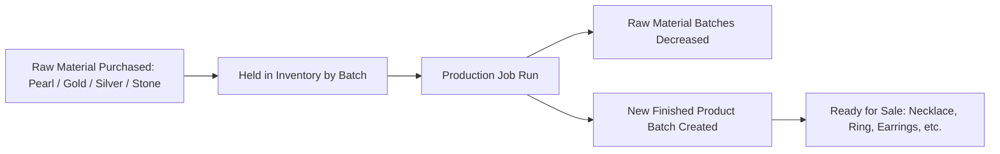
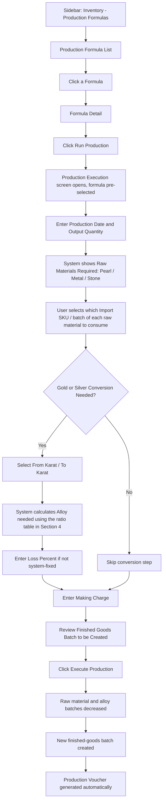

# CountIt — Production: UI Flow & Behavior

**Purpose of this document:** Show how raw materials (pearls, gold, silver, stones) become finished jewellery in CountIt — the production formula that defines what goes into one unit, the screen that actually runs a production job, and the gold/silver conversion math behind it. Meant to be walked through with the client to confirm this matches the actual workshop process before it's built.

**Source verified against:** CountIt Backend Specification (Production section) and the client's own gold/silver conversion reference sheet.

---

## 1. The Core Idea: Raw Materials In, Finished Goods Out

Everything the business **purchases** is a **raw material** — loose pearls, gold, silver, gemstones. Nothing purchased is a finished, sellable product by itself.

Every product the business **sells** — Pearl Necklace, Ear Studs, Ear Drop, Earrings, Necklace, Pendant, Brooch, Chain, Ring, Nose Pin, Polki, Silver Ware, and every item under a Collection — only comes into existence by **running a production job** that consumes raw materials and produces a finished-goods batch.

This single idea drives everything else in this document: Production is not an optional extra step — it is the **only** path from "stuff we bought" to "stuff we can sell."

---

## 2. What the Spec Requires

- Production is the process of converting raw materials into finished goods — e.g., a pearl necklace made by consuming a specific size of pearl, a specific quantity, and various stones/gems.
- Running a production job must:
  - **Decrease** the stock of every raw material consumed, from its specific batch.
  - **Create a new batch** for the finished good produced.
- The business also converts **gold carat quality** — e.g., 24 carat down to 18 carat — by adding copper and other alloy materials.
  - The alloy materials used must be **decreased from stock**.
  - The new-carat gold produced must be **created as a new batch**.
- **Gold conversion ratios must be configurable**, not hardcoded — the actual ratios the client uses are documented in Section 4 below.

---

## 3. Screens Involved

| Screen | Purpose | Status |
|---|---|---|
| Production Formula List | Defines, for one finished product, exactly which raw materials and quantities are required to make one unit | 🟡 Exists in the codebase today (currently labeled using a restaurant-style "Recipe" naming — see note below), but only the definition side works |
| Production Formula Create/Edit | Create or edit a formula | 🟡 Same as above |
| Production Formula Detail | View a single formula | 🟡 Same as above |
| **Production Execution** | Actually run a production job: consume raw materials, apply gold/silver conversion if needed, create the finished-goods batch | ⚫ Does not exist yet — this is the missing piece |

> **Naming note for the client:** the existing screens are currently named "Recipe" in the codebase (`/receipe-management`) — a term carried over from the generic food/restaurant system this app was originally built from. Since CountIt is a jewellery manufacturing workflow, not a kitchen, these should be renamed to something like **"Production Formula"** or **"Bill of Materials."** This is a labeling fix, not a logic change — flagging it here so it gets corrected during implementation.

---

## 4. Gold Conversion — The Actual Ratios in Use

Gold is rarely used at 24 karat purity in finished jewellery. Lower-karat gold is made by adding alloy (copper and other metals) to pure gold. These are the client's confirmed ratios:

| Karat | Gold % | Alloy % |
|---|---|---|
| 9K | 37.5% | 62.5% |
| 14K | 58.3% | 41.7% |
| 18K | 75.0% | 25.0% |
| 22K | 91.6% | 8.4% |
| 24K | 99.9% | 0.1% |

**How this is used in Production Execution:** when converting gold from a higher karat down to a lower karat (e.g., 24K → 18K), the system uses the target karat's Gold %/Alloy % split to calculate exactly how much alloy needs to be added and consumed from stock, for a given weight of gold being converted.

**Unit reference:** 1 Tola = 11.7 grams — this conversion must be available wherever gold/silver weight is entered, since some transactions may be recorded in Tola rather than grams.

### Converting Lower-Karat Gold Back to 24K Equivalent

The client's reference sheet also calculates the reverse: given a weight of 9K, 14K, 18K, or 22K gold, what is its equivalent weight in pure (24K) gold? This matters for valuation and for accepting old/lower-karat gold back into stock at its true gold content.

> **Open item — needs confirmation:** the exact formula for this reverse calculation was not resolvable from the client's reference sheet (the source cells returned a calculation error). Before this logic is built into Production Execution or Purchase Management, the client needs to confirm the intended formula — the working assumption is `Weight in 24K = Input Weight × (Gold % of input karat ÷ Gold % of 24K)`, but this must be verified against the client's own bookkeeping method rather than assumed.

---

## 5. Silver Conversion

Silver has its own purity standards, separate from gold:

| Silver Type | Purity | Alloy % |
|---|---|---|
| Fine Silver | 99.9% (0.999) | 0.10% |
| Sterling Silver | 92.5% (0.925) | 7.50% |

Silver Ware and any silver components in other categories (Mangalsutra, Necklace, etc.) follow this same alloy-deduction logic as gold: converting between Fine Silver and Sterling Silver consumes alloy material from stock.

---

## 6. Loss / Wastage (Jarti)

The client's process includes a **6% loss allowance ("Jarti")** applied to gold and silver during production — accounting for material lost in the process of working, melting, or shaping the metal.

> **Confirm with client:** should this 6% be automatically deducted from the raw material batch every time a gold/silver production job runs (i.e., the system assumes 6% is always lost and adjusts stock accordingly), or is it a manually entered value per job since actual loss may vary? This changes whether "Loss %" is a fixed system setting or a field the user fills in each time.

---

## 7. Alloy Accounting & Making Charge

Two more cost/material elements are part of every production job, per the client's process:

- **Alloy Hisab** *("alloy accounting")* — the running account of how much alloy material has been consumed and remains in stock, separate from pure gold/silver stock.
- **Making Charge** — the labour/craftsmanship cost of producing the item, entered as part of the production job.

> **Confirm with client:** is Making Charge a flat amount entered once per production job, a rate per gram of finished product, or a rate that varies by product category (e.g., a Ring costs more per gram to make than a Chain)? This determines whether it's a single input field or a small rate table.

---

## 8. Raw Material Types & the Import SKU (IMP_SKU)

Raw materials purchased for production fall into three types, each tracked with its own **Import SKU (IMP_SKU)** — a code assigned at the time of purchase that auto-fills the material's details wherever it's used, so production doesn't require re-typing the same attributes.

| Raw Material Type | Can Have Multiple Entries? | Import SKU Auto-Fills | Applies To |
|---|---|---|---|
| **Pearl** | Yes | All pearl details | All pearl-bearing categories |
| **Metal (Gold/Silver)** | — | Color (gold only), Karat, Weight (grams) | Any category using gold or silver |
| **Stone** | Yes | Stone Type, Color, Clarity (diamonds only) | Any category using stones/gems/diamonds |

**Pearl-specific fields** (only relevant when the finished product is a Pearl Necklace):
- **Strand:** Single, 2 Strand, 3 Strand, 4 Strand, 5 Strand, or Choker
- **Length:** 16 in, 17–18 in, 21–22 in, 26 in, or 33 in

**Why the Import SKU matters here:** when a production job consumes a raw material, the system uses that material's Import SKU to know exactly which inventory batch to deduct weight/quantity from — this is what keeps the "decrease stock from the correct batch" rule in Section 2 accurate, rather than deducting from the wrong batch of a similar-looking material.

> **Note for the client:** the reference sheet lists the same Import SKU description ("gives details of Stone Type, color & Clarity") under both **Metal Details** and **Stone Details** — this looks like it may be a copy/paste carry-over in the source sheet, since Metal Details' own fields are Color/Karat/Weight, not Stone Type/Clarity. Flagging this so it can be confirmed rather than built exactly as written.

---

## 9. Step-by-Step UI Flow (Target Design — To Be Built)

### Walkthrough in plain language

1. **Start from the Production Formula List** — this already exists and lists every defined formula (e.g., "Pearl Necklace — 7.5mm Lavender, Single Strand").
2. **Open a formula's detail page**, and click a new **"Run Production"** button *(needs to be added — does not exist yet)*.
3. This opens the new **Production Execution** screen, with the formula already selected.
4. **Enter the production date** and **how many units** are being produced.
5. The screen shows exactly which raw materials are required — broken down by Pearl, Metal, and Stone, per Section 8.
6. **Pick the specific Import SKU/batch** to consume for each raw material.
7. **If gold or silver conversion is happening** (e.g., 24K → 18K): select the starting and target karat. The system calculates the alloy quantity automatically using the ratio table in Section 4, and — depending on the client's answer in Section 6 — either applies the 6% loss automatically or asks for it manually.
8. **Enter the Making Charge** for this job (see Section 7 for the open question on how this is structured).
9. **Review the finished-goods batch** the system will create.
10. **Click "Execute Production."** At this point:
    - Every raw material batch used (pearl, metal, stone, alloy) has its quantity reduced.
    - A brand-new batch is created for the finished product, ready for Sales Billing or Label Printing.
    - An accounting voucher is generated automatically — production is a real inventory and financial event.

---

## 10. Role Visibility

| Action | Org Admin | Internal Finance | Store Manager | Sales Team |
|---|---|---|---|---|
| View Production Formulas | ✅ | ✅ | ✅ | ✅ |
| Create/Edit Production Formulas | ✅ | ✅ | ✅ | ❌ |
| Run Production *(new)* | ✅ | ✅ | ✅ | ❌ |
| Configure Gold/Silver Conversion Ratios *(new)* | ✅ | ✅ | ❌ | ❌ |

---

## 11. What's Confirmed vs. What Needs the Client's Answer

**Confirmed and working today:** defining a production formula (what raw materials + quantities make one finished unit).

**Confirmed data (from the client's own reference sheet):** gold conversion ratios per karat (Section 4), 1 Tola = 11.7g, silver purity standards (Section 5), 6% Jarti loss figure (Section 6).

**Needs a decision before we call this "done":**
- The exact formula for converting lower-karat gold back to a 24K equivalent (Section 4) — the source sheet's calculation errored out.
- Is the 6% loss (Jarti) automatic on every job, or manually entered each time? (Section 6)
- Is Making Charge a flat amount, a per-gram rate, or category-specific? (Section 7)
- Confirm whether the Import SKU description under "Metal Details" should really pull Stone Type/Clarity, or whether that was a copy/paste artifact and it should instead pull Color/Karat/Weight. (Section 8)
- Should the screens currently labeled "Recipe" in the codebase be renamed to "Production Formula" (or another term the client prefers) as part of this build?

