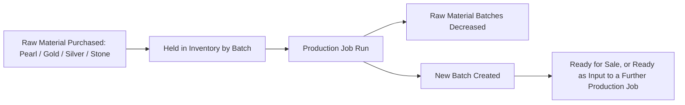
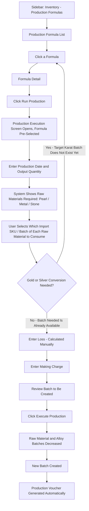

# CountIt — Production: UI Flow & Behavior

**Purpose of this document:** Show how raw materials (pearls, gold, silver, stones) become finished jewellery in CountIt — the production formula that defines what goes into one unit, the screen that actually runs a production job, and the gold/silver conversion math behind it. Meant to be walked through with the client to confirm this matches the actual workshop process before it's built.

---
## 1. The Core Idea: Raw Materials In, Finished Goods Out

Everything the business **purchases** is a **raw material** — loose pearls, gold, silver, gemstones. Nothing purchased is a finished, sellable product by itself.

Every product the business **sells** — Pearl Necklace, Ear Studs, Ear Drop, Earrings, Necklace, Pendant, Brooch, Chain, Ring, Nose Pin, Polki, Silver Ware, and every item under a Collection — only comes into existence by **running a production job** that consumes raw materials and produces a new batch.

This single idea drives everything else in this document: Production is not an optional extra step — it is the **only** path from "stuff we bought" to "stuff we can sell." As of this revision, that also includes karat-converted metal itself — see Section 8 for why a conversion is now treated as its own production job rather than a step inside another one.

---

## 2. What the Spec Requires

- Production is the process of converting raw materials into finished goods — e.g., a pearl necklace made by consuming a specific size of pearl, a specific quantity, and various stones/gems.
- Running a production job must:
    - **Decrease** the stock of every raw material consumed, from its specific batch.
    - **Create a new batch** for what's produced.
- The business also converts **gold carat quality** — e.g., 24 carat down to 18 carat — by adding copper and other alloy materials.
    - The alloy materials used must be **decreased from stock**.
    - The new-carat gold produced must be **created as a new batch**.
- **Gold conversion ratios must be configurable**, not hardcoded — the actual ratios the client uses are documented in Section 3 below.

---

## 3. Gold Conversion — The Actual Ratios in Use

Gold is rarely used at 24 karat purity in finished jewellery. Lower-karat gold is made by adding alloy (copper and other metals) to pure gold. These are the client's confirmed ratios:

|Karat|Gold %|Alloy %|
|---|---|---|
|9K|37.5%|62.5%|
|14K|58.3%|41.7%|
|18K|75.0%|25.0%|
|22K|91.6%|8.4%|
|24K|99.9%|0.1%|

**How this is used, per the updated flow:** karat conversion is no longer calculated inline while running a finished-goods production job (see Section 8 for why). Instead, this ratio table is used when **defining a Karat Conversion Formula** — a Production Formula in its own right, whose raw material requirement is "X grams of higher-karat gold + Y grams of alloy," with Y derived from this table. Running that formula through Production Execution is what actually converts the metal and creates the lower-karat batch.

> **Needs a decision:** confirm that this ratio table is meant to be applied **at the point a Karat Conversion Formula is defined** (i.e., baked into the formula's own raw material requirement), rather than recalculated dynamically every time it's run. This wasn't explicit in the updated flow and shouldn't be assumed without checking.

**Unit reference:** 1 Tola = 11.7 grams — this conversion must be available wherever gold/silver weight is entered, since some transactions may be recorded in Tola rather than grams.

### Converting Lower-Karat Gold Back to 24K Equivalent

The client's reference sheet also calculates the reverse: given a weight of 9K, 14K, 18K, or 22K gold, what is its equivalent weight in pure (24K) gold? This matters for valuation and for accepting old/lower-karat gold back into stock at its true gold content.

> **Open item — needs confirmation:** the exact formula for this reverse calculation was not resolvable from the client's reference sheet (the source cells returned a calculation error). Before this logic is built into Production Execution or Purchase Management, the client needs to confirm the intended formula — the working assumption is `Weight in 24K = Input Weight × (Gold % of input karat ÷ Gold % of 24K)`, but this must be verified against the client's own bookkeeping method rather than assumed.

---

## 4. Silver Conversion

Silver has its own purity standards, separate from gold:

|Silver Type|Purity|Alloy %|
|---|---|---|
|Fine Silver|99.9% (0.999)|0.10%|
|Sterling Silver|92.5% (0.925)|7.50%|

Silver Ware and any silver components in other categories (Mangalsutra, Necklace, etc.) follow this same alloy-deduction logic as gold, and — per the updated flow — the same "conversion is its own production job" rule described in Section 8 applies equally to silver purity conversion.

---

## 5. Loss / Wastage (Jarti)

The client's process includes a **6% loss allowance ("Jarti")** applied to gold and silver during production — accounting for material lost in the process of working, melting, or shaping the metal.

> **Resolved by this revision:** the updated flow now shows Loss being entered explicitly as **"Loss — Calculated Manually"** at the point of running any production job. This confirms the answer to what was previously an open question: **Loss is a manual entry made by the user on every production run, not a fixed 6% the system applies automatically.** The 6% figure remains the client's typical/expected reference point, but the field itself is user-entered each time, not system-fixed.

---

## 6. Alloy Accounting & Making Charge

Two more cost/material elements are part of every production job, per the client's process:

- **Alloy accounting** _("alloy accounting")_ — the running account of how much alloy material has been consumed and remains in stock, separate from pure gold/silver stock.
- **Making Charge** — the labour/craftsmanship cost of producing the item, entered as part of the production job.

> **Require COnfirmation:** is Making Charge a flat amount entered once per production job, a rate per gram of finished product, or a rate that varies by product category (e.g., a Ring costs more per gram to make than a Chain)? This determines whether it's a single input field or a small rate table. Still open — unaffected by this revision.

---

## 7. Raw Material Types & the Import SKU (IMP_SKU)

Raw materials purchased for production fall into three types, each tracked with its own **Import SKU (IMP_SKU)** — a code assigned at the time of purchase that auto-fills the material's details wherever it's used, so production doesn't require re-typing the same attributes.

| Raw Material Type       | Can Have Multiple Entries? | Import SKU Auto-Fills                      | Applies To                              |
| ----------------------- | -------------------------- | ------------------------------------------ | --------------------------------------- |
| **Pearl**               | Yes                        | All pearl details                          | All pearl-bearing categories            |
| **Metal (Gold/Silver)** | Yes                        | Color (gold only), Karat, Weight (grams)   | Any category using gold or silver       |
| **Stone**               | Yes                        | Stone Type, Color, Clarity (diamonds only) | Any category using stones/gems/diamonds |

**Pearl-specific fields** (only relevant when the finished product is a Pearl Necklace):

- **Strand:** Single, 2 Strand, 3 Strand, 4 Strand, 5 Strand, or Choker
- **Length:** 16 in, 17–18 in, 21–22 in, 26 in, or 33 in

**Why the Import SKU matters here:** when a production job consumes a raw material, the system uses that material's Import SKU to know exactly which inventory batch to deduct weight/quantity from — this is what keeps the "decrease stock from the correct batch" rule in Section 2 accurate, rather than deducting from the wrong batch of a similar-looking material. This is also how, per the updated flow, the system determines whether the _specific karat batch_ a finished-goods formula needs already exists — it's checking for an Import-SKU-identified batch at that exact karat, not just "gold in general."

> **Note for the client:** the reference sheet lists the same Import SKU description ("gives details of Stone Type, color & Clarity") under both **Metal Details** and **Stone Details** — this looks like it may be a copy/paste carry-over in the source sheet, since Metal Details' own fields are Color/Karat/Weight, not Stone Type/Clarity. Flagging this so it can be confirmed rather than built exactly as written.

---

## 8. Step-by-Step UI Flow (Updated)

This is the corrected flow. The key structural change from the previous version: **gold/silver karat conversion is no longer performed inline as a sub-step inside a finished-goods production run.** Instead, Production Execution checks whether the specific karat batch a formula calls for **already exists in inventory**. If it doesn't, the user is sent back to select and run the appropriate **Karat Conversion Formula first** — as its own, separate production job — before returning to run the original formula.

### Two Kinds of Production Formula

|Formula Type|What It Consumes|What It Produces|
|---|---|---|
|**Finished-Goods Formula**|Pearl / Metal / Stone raw materials, at a specific karat/attribute|A sellable finished-goods batch (Necklace, Ring, etc.)|
|**Karat Conversion Formula**|Higher-karat gold (or higher-purity silver) + alloy|A new batch of the lower-karat gold (or lower-purity silver), ready to be consumed by a Finished-Goods Formula|

Both are run through the exact same Production Execution screen and the exact same steps below — the only difference is what they consume and what batch they leave behind. This is why the diagram's final step now reads "New batch created" rather than "New finished-goods batch created" — a conversion run's output is just as much a real batch as a finished piece is.

### Walkthrough in plain language

1. **Start from the Production Formula List** — this already exists and lists every defined formula, of either type (Finished-Goods or Karat Conversion).
2. **Click a formula**, opening its **Formula Detail** page.
3. **Click "Run Production"** _(needs to be added — does not exist yet)_, which opens **Production Execution** with the formula pre-selected.
4. **Enter the production date** and **how many units** are being produced.
5. The screen shows exactly which raw materials this formula requires — broken down by Pearl, Metal, and Stone.
6. **Pick the specific Import SKU/batch** to consume for each raw material.
7. **The system checks whether the specific karat/purity batch this formula needs already exists in inventory:**
    - **If it doesn't exist yet** — the user is sent back to the Production Formula List to find and run the correct **Karat Conversion Formula** first, as its own separate production job. That run follows this exact same flow end-to-end, and its output (the newly converted-karat batch) is what makes the "batch needed is already available" condition true. Once that conversion run is complete, the user comes back and starts the original finished-goods formula again from Step 1.
    - **If it already exists** — no conversion sub-step is needed inline. The flow proceeds directly to Loss entry.
8. **Enter Loss** — a manually calculated and entered figure (see Section 5; this is no longer an automatic system deduction).
9. **Enter the Making Charge** for this job (see Section 6 for the open question on how this is structured).
10. **Review the batch** the system will create — a finished-goods batch, or a converted-metal batch, depending on which type of formula was run.
11. **Click "Execute Production."** At this point:
    - Every raw material batch used (pearl, metal, stone, alloy) has its quantity reduced.
    - A brand-new batch is created for whatever this run produced.
    - An accounting voucher is generated automatically — production is a real inventory and financial event, regardless of formula type.

---

## 9. Role Visibility

|Action|Org Admin|Internal Finance|Store Manager|Sales Team|
|---|---|---|---|---|
|View Production Formulas|✅|✅|✅|✅|
|Create/Edit Production Formulas (Finished-Goods or Karat Conversion)|✅|✅|✅|❌|
|Run Production _(new)_|✅|✅|✅|❌|
|Configure Gold/Silver Conversion Ratios _(new)_|✅|✅|❌|❌|

---

## 10. What's Confirmed vs. What Needs the Client's Answer

**Confirmed and working today:** defining a production formula (what raw materials + quantities make one finished unit).

**Confirmed data (from the client's own reference sheet):** gold conversion ratios per karat (Section 3), 1 Tola = 11.7g, silver purity standards (Section 4).

**Newly confirmed by this revision:**

- Gold/Silver karat conversion is its own separate production job (a Karat Conversion Formula), not an inline sub-step of a finished-goods run — resolved by the updated flow (Section 8).
- Loss (Jarti) is a manually entered figure on every production run, not an automatic 6% system deduction (Section 5).

