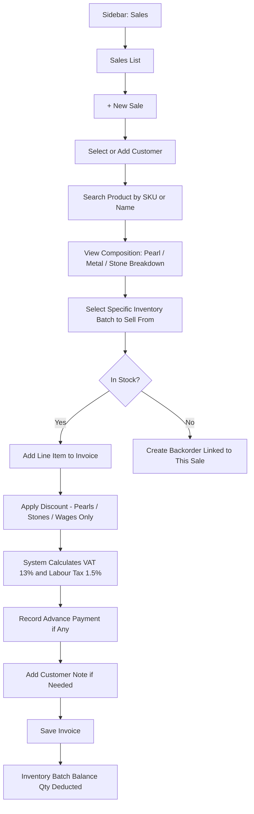

# CountIt Sales Management UI Flow And Behavior
**Purpose of this document:** Show how a sale is made in CountIt — product/composition lookup, batch-level stock selection, discount and tax rules, and cost-price visibility — so the client can confirm this matches how sales staff actually sell jewellery day to day.

> **Scope note:** the spec splits Sales Management and Billing Management into two sections. This document covers the sales-side flow — selecting the customer, the product, the specific batch, and the resulting inventory deduction. Full invoice mechanics (advance payment tracking, delivery status, discount-before-tax math in detail) belong to a future Billing Management document and are only touched on here where they directly shape the Sales screen itself.

---

## 1. What the Spec Requires

- Sales users **cannot view the product's purchase/cost price.**
- Sales users must be able to see **what a product is actually made of** — e.g. a pearl necklace's composition: pearl color, size, length, etc.
- While making a sale, the sales person must **choose the specific stock item/batch** being sold, so that exact batch is properly deducted from inventory.
- Users must be able to maintain **customer notes.**
- (From the Billing reference sheet, directly relevant to how a sale calculates its total): **Discount applies only to Pearls, Stones, and Wages/Labour — never to Gold or Silver metal value** — and discount is applied **before** tax. **VAT of 13%** applies to Pearl & Stone value; **Labour/Craftsmanship Tax of 1.5%** applies to Gold value.

---

## 2. Step-by-Step UI Flow

### Walkthrough in plain language

1. **Sales List (`/sales`)** — every invoice created: Invoice No, Customer, Date, Amount, Payment Status, Delivery Status.
2. **+ New Sale** — opens Sales Create.
3. **Select the customer**, or quick-add a new one if they're not in the system yet (full customer fields live in Customer Management).
4. **Search for the product** by SKU or name. The system shows the **composition breakdown** (Section 4) so the sales person — and the customer — can see exactly what they're buying.
5. **Select the specific inventory batch** this line is being sold from (Section 5) — not just "this SKU," but this exact batch.
6. **If nothing's in stock,** the sales person can create a **Backorder** linked to this sale instead of a normal line item (full backorder behavior belongs to its own module document — this is just the trigger point).
7. **Apply a discount**, if any — restricted to Pearl, Stone, and Wages/Labour value only; Gold and Silver metal value is never discounted.
8. **VAT and Labour Tax calculate automatically** based on product composition (Section 6).
9. **Record an advance payment**, if the customer is paying part now.
10. **Add a customer note**, if relevant (e.g. a special request, sizing note).
11. **Save.** The invoice is created and the selected batch's Balance Qty is deducted in the Inventory ledger.

---

## 3. Composition Display — "What Is This Made Of"

Per spec, a sales person must be able to show a customer what a piece actually contains. This mirrors the same Pearl/Metal/Stone attribute blocks used everywhere else, but as a **read-only, customer-facing display** rather than an entry form:

|Block|What's Shown|
|---|---|
|**Pearl**|Product Name, Pearl Type, Color, Shape, Size, Strand|
|**Metal**|Product Name, Metal Code (Gold/Silver), Color, Karat, Weight|
|**Stone**|Product Name, Stone Type, Weight, Qty, Carat|

A finished product typically pulls from more than one block at once (e.g. a pearl necklace with a gold clasp and small diamond accents shows all three). This is populated automatically from the raw-material batches that were consumed when the item was produced (see Production document) — the sales person doesn't enter this, they just see it.

> **Needs a decision:** for a **Combo Product** (a bundle of multiple separately-sellable finished items, per Product Management Section 2.6), does the composition display break down each bundled item separately, or just list the bundle's contents by name without a full attribute breakdown per item? Not yet resolved.

---

## 4. Batch Selection & Inventory Deduction

Every sale must draw from a specific, identifiable batch in inventory — never a generic "SKU has X units available." This is what lets a customer's purchase (and any later return) trace back to the exact physical item and its attributes.

> **Needs a decision:** should batch selection be **automatic** (e.g. FIFO — oldest batch first) with a manual override available, or should the sales person **always manually pick** the batch every time? Automatic-with-override is the more common retail pattern and reduces sales-floor friction, but hasn't been confirmed.

---

## 5. Discount & Tax Rules

|Rule|Applies To|Rate|
|---|---|---|
|Discount|Pearls, Stones, Wages/Labour value only — **never** Gold or Silver metal value|Configurable per sale/product|
|Discount timing|Applied **before** tax calculation|—|
|VAT|Pearl and Stone value|13%|
|Labour/Craftsmanship Tax|Gold value only|1.5%|

These figures come directly from the client's own billing reference and match the spec's Tax Management and Billing Management sections — included here because they directly affect what the Sales screen needs to calculate and display as a line total, even though full invoice formatting belongs to the future Billing document.

---

## 6. Cost/Price Visibility Rule

Consistent with the hard rule established in User Management and carried through every module since: **Sales Team must never see a product's purchase/cost price**, anywhere in the Sales flow — product search results, the line item, or the invoice total breakdown. Only the customer-facing selling price and the calculated tax/discount are visible to this role.

---

## 7. Customer Notes

A free-text note field, tied to the customer record (or to the specific invoice — see open question below), for things like sizing requests, gifting occasions, or preferences the sales team wants remembered for next time.

> **Needs a decision:** should Customer Notes live on the **customer's profile** (visible across all their future sales) or be **per-invoice** (a note specific to this one transaction)? Likely both have a place, but only one was mentioned in the spec.

---

## 8. Backorder Trigger

If a product isn't currently in stock, the sales person can create a Backorder directly from this screen instead of completing a normal sale line. A Backorder is linked to the original sales invoice, records the customer's required delivery date and an expected completion date, and indicates whether the item will be produced in Nepal or Hong Kong. Full Backorder Management behavior (statuses, reporting) belongs to its own module document — this document only covers the fact that Sales is where a backorder gets triggered.

---

## 9. Role Visibility

| Action                     | Org Admin | Internal Finance | Store Manager | Sales Team |
| -------------------------- | --------- | ---------------- | ------------- | ---------- |
| View Sales List            | ✅         | ✅                | ✅             | ✅          |
| Create Sale                | ✅         | ✅                | ✅             | ✅          |
| View Purchase/Cost Price   | ✅         | ✅                | ❌             | ❌          |
| View Composition Breakdown | ✅         | ✅                | ✅             | ✅          |
| Select Inventory Batch     | ✅         | ✅                | ✅             | ✅          |
| Apply Discount             | ✅         | ✅                | ✅             | ✅          |
| Create Backorder           | ✅         | ✅                | ✅             | ✅          |

