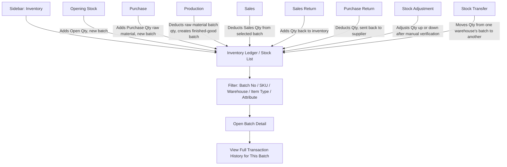

# CountIt — Inventory Stock Maintenance: UI Flow & Behavior

**Purpose of this document:** Show how CountIt tracks stock — batch numbers, the Pearl/Metal/Stone attribute blocks, quantities, and unit conversion — as one continuous ledger fed by every other transactional module, so the client can confirm this matches how they actually think about "what do we have, and where."

---

## 1. What the Spec Requires

- Every product must be tracked with a **unique batch number** generated at Opening Stock, Purchase, or Production — so stock from different events is never mixed together even if it's the same SKU.
- Inventory must be trackable by: **Batch No, Product SKU, attribute details, Open Qty, Purchase Qty, Sales Qty, Balance Qty, Unit, and Unit Conversion.**
- The original spec text lists a flat attribute set (Color, Size, Shape, Clarity, Quality, Stone Type, Weight, Length) for this tracking.

> **Update applied in this document:** per the Pearl/Metal/Stone block model confirmed in Product Management (Section 2.8) and Production (Section 8), inventory attribute tracking is restated below using those three blocks instead of the old flat list — because that flat list doesn't actually match how attributes were later broken down with the client. This is the same reconciliation noted as outstanding in the project handoff; it is applied here so this document doesn't reintroduce the old model.

---

## 2. Step-by-Step UI Flow

### Walkthrough in plain language

1. **Inventory Ledger (`/inventory`)** — a single searchable table of every batch currently or previously in stock, across all warehouses. This is the "what do we have" screen.
2. **Filter/search** by Batch No, Product SKU, Warehouse, Item Type (Raw Material vs Finished Good), or by attribute (e.g. all Lavender pearls, all 18K Yellow Gold).
3. **Click a row** to open **Batch Detail** — shows every attribute for that batch (per its Pearl/Metal/Stone block), which warehouse it sits in, and its running quantity math (see Section 4).
4. **Transaction History** inside Batch Detail — every event that touched this batch's quantity: the Opening Stock or Purchase or Production event that created it, every Sale that drew from it, any Return that added back to it, any Adjustment or Transfer.
5. Inventory itself never has a "create new stock" button — new batches only ever originate from Opening Stock, Purchase, or Production (as finished-goods output). Everything else here is view/search/report.

---

## 4. What Gets Tracked Per Batch

|Field|Meaning|
|---|---|
|Batch No|Unique per Opening Stock entry, per Purchase Reference, or per Production run output (see each module's own document for exactly how its batch number is generated)|
|Product SKU|Which product/raw-material type this batch is|
|Item Type|Raw Material (Pearl / Metal / Stone) or Finished Good|
|Attribute Block|Pearl, Metal, or Stone details for raw material batches (Section 5); finished-good attributes for produced batches|
|Warehouse|Which outlet/store holds this batch (see Warehouse Management)|
|Open Qty|Quantity captured at Opening Stock, if this batch originated there|
|Purchase Qty|Quantity brought in via Purchase, if this batch originated there|
|Production In / Out|For raw material: qty consumed by a Production job. For finished goods: qty created by a Production job|
|Sales Qty|Cumulative quantity sold out of this batch|
|Return Qty|Quantity added back via Sales Return (or removed via Purchase Return)|
|Adjustment Qty|Any manual correction (+/-) from Stock Adjustment|
|Transfer Qty|Quantity moved out of / into this batch via Stock Transfer|
|Balance Qty|Running total: everything in, minus everything out|
|Unit|Base unit this batch is tracked in (pieces, grams, carats, strand)|

**Balance Qty = Open/Purchase/Production-In Qty + Return Qty + Adjustment(+) − Sales Qty − Production-Out Qty − Purchase Return Qty − Adjustment(−) − Transfer-Out Qty (+ Transfer-In Qty at the receiving warehouse).**

---

## 5. Attribute Tracking — Pearl / Metal / Stone Blocks

Consistent with Product Management and Production, a batch's attributes depend on which block applies to it:

|Block|Tracked Attributes|
|---|---|
|**Pearl**|Import SKU, Pearl Type, Color, Shape, Size, Stock Type (Strand/Loose/Drop), Quality, Qty, In-Date. Strand & Length fields apply only when the batch is for Pearl Necklace.|
|**Metal**|Import SKU, Metal Code (Gold/Silver), Color (Gold only), Karat, Weight (in grams), In-Date|
|**Stone**|Import SKU, Stone Type, Shape, Weight, Qty, Carat, Color (diamond only), Clarity (diamond only), In-Date|

A **finished-good batch** (output of Production) carries its own SKU and attributes as a completed product, plus a record of which raw-material batches were consumed to make it — this consumption link is what lets Sales show a "what is this made of" composition breakdown (see Sales Management document).

> Same open flag as in Product Management: the Nose Pin category has no confirmed attribute block, and the source sheet's Import SKU description was duplicated identically under both Metal and Stone — neither has been resolved, and both apply here too since Inventory just reflects whatever blocks are defined at the product/attribute level.

---

## 6. Unit & Unit Conversion

Different item types are naturally tracked in different units — pieces for pearls, grams for metal, carats for stones. The spec also calls for **Unit Conversion** to be tracked.

The clearest real-world case is metal: **1 Tola = 11.7 grams.** A batch of gold might be purchased/held in grams but need to display in Tola for the business's own reference (or vice versa).

> **Needs a decision:** is Unit Conversion just a **display convenience** (show the same balance in an alternate unit, e.g. "175.5g / 15 Tola"), or does the business need to **purchase or sell in one unit and track in another**, requiring the conversion to actually affect the stored balance math? This changes whether it's a formatting feature or a calculation feature.

---

## 7. Warehouse-Wise Tracking

Every batch belongs to exactly one warehouse at a time. The Inventory Ledger should be filterable by warehouse, and Stock Transfer is the only event that moves a batch (or a split quantity of it) from one warehouse to another. Warehouse-wise inventory reports are a separate Reports-module deliverable — this document only covers the ledger data those reports would pull from.

---

## 8. Role Visibility

|Action|Org Admin|Internal Finance|Store Manager|Sales Team|
|---|---|---|---|---|
|View Inventory Ledger (qty, attributes)|✅|✅|✅|✅|
|View Purchase/Cost Value per Batch|✅|✅|❌|❌|
|View Batch Transaction History|✅|✅|✅|❌|
|Filter by Warehouse|✅|✅|✅ (own warehouse)|✅ (own warehouse)|

> Cost/purchase-value figures are hidden from Store Manager and Sales Team throughout the ledger and batch detail views, consistent with the hard rule established in User Management and Purchase Management (Sales Team/Store Manager must never see purchase/cost price).

---

## 9. What's Confirmed vs. What Needs the Client's Answer

**Confirmed:** batch-based tracking; Balance Qty as a running ledger fed by every other module; Pearl/Metal/Stone attribute blocks apply here the same way they do in Product/Purchase/Production; cost values hidden from Store Manager/Sales Team.

**Needs a decision:**

- Is Unit Conversion (e.g. grams ↔ Tola) a display-only convenience or does it need to affect stored quantity math? (Section 6)
- Same open items carried over from Product Management: Nose Pin's blank attribute block, and the duplicated Metal/Stone Import SKU description.
