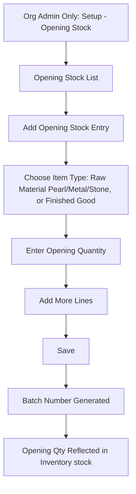

# CountIt — Opening Stock Management: UI Flow & Behavior

**Purpose of this document:** Show how existing stock gets captured into CountIt on day one — before any real Purchase or Sales entry begins — so the client can confirm this one-time setup matches how they'll actually bring their current jewellery and raw material stock into the system.

---

## 1. What the Spec Requires

- Opening Stock captures **existing stock inventory items** before proper Sales or Purchase entry begins.
- It is done **only once, at the beginning of the system, by the Org Admin.**

That's the entirety of the spec's own text on this module — everything else below is this document reasoning through what that one-time capture actually needs to contain, given everything else already defined for Product, Purchase, Production, and Inventory.

---
## 2. Step-by-Step UI Flow

### Walkthrough in plain language

1. **Opening Stock List (`/opening-stock`)** — shows every opening-stock line entered so far, for reference. Likely only ever populated once, around go-live.
2. **Add Opening Stock Entry** — Org Admin picks whether this line is a raw material (Pearl, Metal, or Stone — same Import SKU model as Purchase) or an already-finished product sitting on the shelf.
3. **Assign attributes** for that line, same block structure used everywhere else in the system (Section 4).
4. **Enter the opening quantity** the business currently holds, and a **valuation rate** (what this stock is worth, for accounting/inventory-valuation purposes going forward).
5. **Add as many lines as needed** — one opening stock capture will typically have many lines (every raw material type and every finished item currently on hand).
6. **Save.** A batch number is generated (see Section 5 for the open question on exactly how), and the quantity now shows up in the Inventory stock as this batch's Open Qty.

---

## 3. Raw Material vs. Finished Goods — An Important Difference From Purchase

Every other document in this set (Product, Purchase, Production) has established that **the only way a sellable finished product normally comes into existence is through a Production job converting raw materials.** Opening Stock is the one deliberate exception to that rule:

> **Flagging this clearly because it's easy to miss:** at go-live, the business will already have finished jewellery — necklaces, rings, earrings already made — sitting in the shop, that were **not produced inside CountIt** (they were made before the system existed). Opening Stock therefore needs to support capturing **both**:
> 
> - **Raw material opening stock** (loose pearls, metal, stones on hand) — same Pearl/Metal/Stone/Import SKU model as Purchase.
> - **Finished-good opening stock** (already-made jewellery on hand) — entered directly as a finished SKU with its own opening quantity, **without** going through a Production job, since there's no raw-material consumption to record for stock that already existed before the system went live.
> 
> This needs explicit client confirmation, since every other document in this set treats "finished good only exists after Production" as close to a hard rule.

---

## 4. Batch Number Logic — Needs a Decision

Purchase Management established that **one batch number is generated per Purchase Reference**, shared by every line item on that bill. Opening Stock doesn't have an equivalent "one bill, many items" grouping — it's a single setup exercise, potentially entered in one sitting or over several sessions.

**Approach A — one batch number per Opening Stock line item.** Each raw material or finished-good line entered gets its own distinct batch number, since each represents a genuinely separate physical stock item (this pearl strand vs. that gold chain), unlike a purchase bill where the items were bought together as one transaction.

**Approach B — one batch number per Opening Stock session/reference,** mirroring the Purchase model, where everything entered in one "opening stock capture" shares a batch number.

---

## 5. Is This Truly a One-Time, Locked Action?

The spec says Opening Stock happens "only once, at the beginning." Two things need clarifying:

- **Can Org Admin add more Opening Stock lines later** (e.g. stock that was missed the first time, or a second location going live later), or does the screen lock/disable itself after the first save?
- **Can an Opening Stock line be edited or deleted after Purchase/Sales activity has already started against the system** — or does that risk corrupting later transaction history that assumes the ledger was accurate from day one?

---

## 6. Role Visibility

| Action                     | Org Admin | Internal Finance | Store Manager | Sales Team |
| -------------------------- | --------- | ---------------- | ------------- | ---------- |
| Create Opening Stock Entry | ✅         | ❌                | ❌             | ❌          |
| View Opening Stock List    | ✅         | ✅                | ✅             | ✅          |
| Edit/Delete Existing Entry | ✅         | ❌                | ❌             | ❌          |

---

## 7. What's Confirmed vs. What Needs the Client's Answer

**Confirmed:** Org-Admin-only creation; captures pre-existing stock before Purchase/Sales begins; feeds directly into the Inventory ledger as Open Qty.

**Needs a decision:**

- Opening Stock must support finished-goods entries directly, bypassing Production — confirm this exception is acceptable (Section 4).
- Batch number logic — recommend Approach A, one batch per line item (Section 5).

