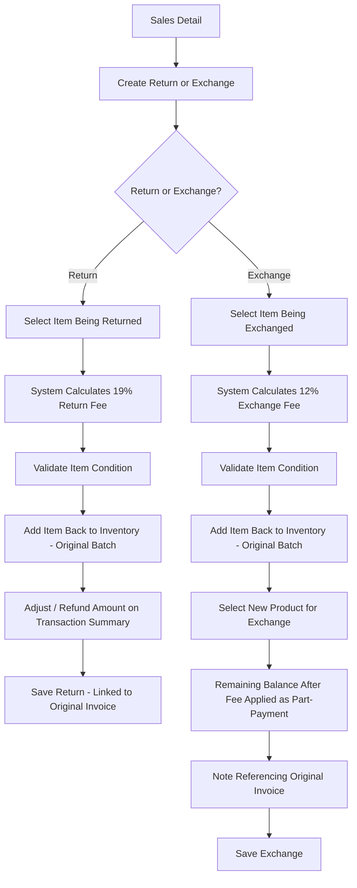

# CountIt — Sales Return: UI Flow & Behavior

**Purpose of this document:** Show how a customer return or exchange is handled — the 12%/19% fee rules, how the item goes back into inventory, and how it stays linked to the original sale — so the client can confirm this matches how returns and exchanges are actually processed in the shop.

---
## 1. What the Spec Requires

- Returned items are added back to inventory with the **appropriate batch details**, after validation.
- The system must support **product exchanges**, in addition to plain returns.
- A **12% exchange fee** is automatically calculated and applied to exchange transactions.
- A **19% return fee** is automatically calculated and applied to return transactions.
- The applicable fee must be reflected in the **transaction summary.**
- Every return/exchange must be **linked to the original sales transaction.**

## Note 
   - Should 12% deduction on the exchange and 19% deduction on the return amount be auto calculated or manually entered ( 12% for exchange and 19% for return Changable ? )

From the client's own billing reference, two details sharpen this further:

- On an exchange, the **balance remaining after the 12% deduction becomes part-payment toward the new product.**
- On an exchange, the transaction should carry a **note referencing the original invoice**, so it's clear at a glance that this is an exchange and not a fresh sale.

---
## 3. Step-by-Step UI Flow

### Walkthrough in plain language

1. **Start from the original Sales Detail screen** — Sales Return isn't a standalone "create from scratch" action; it's always launched against a specific past invoice, since every return/exchange must link back to it.
2. **Choose Return or Exchange.**
3. **Select the specific item** (and batch) being returned or exchanged.
4. **The fee calculates automatically** — 19% for a return, 12% for an exchange — no manual entry.
5. **Validate the item's condition** before anything is finalized (Section 5 covers what this actually means in the workflow).
6. **The item is added back into inventory**, restoring its Balance Qty in the Inventory ledger.
7. **For a return:** the transaction summary reflects the fee-adjusted refund amount.
8. **For an exchange:** the customer picks a new product, the balance remaining after the 12% deduction is applied as part-payment toward it, and a note referencing the original invoice is attached so the exchange's history is traceable.
9. **Save** — the record stays permanently linked to the original sales transaction.

---

## 4. Return vs. Exchange Fee

|Type|Fee|Effect|
|---|---|---|
|Return|19%|Deducted from the refund amount|
|Exchange|12%|Deducted from the exchanged item's value; remainder becomes part-payment on the new item|

---

## 5. Validation — Needs a Decision

The spec says returned items go back to inventory "after validation," and separately, the Stock Adjustment section of the spec mentions "**approved** returned or exchanged products should be added back to inventory" — which suggests there may be an approval step involved, not just a simple condition check by whoever processes the return.

> **Needs a decision:** is "validation" here just the **sales staff visually checking the item's condition** on the spot (a simple pass/fail before saving), or does it involve a **formal approval step** — e.g. a Store Manager or Internal Finance sign-off — before the quantity is actually restored to inventory? The spec mentions "approval" in the Stock Adjustment section specifically, which may mean approval only applies when a return additionally requires a stock _adjustment_ (e.g. the item is damaged and needs write-off rather than a straight re-stock), rather than every return. **Recommend confirming with the client which scenario applies**, since it changes whether Sales Return needs its own approval workflow or can rely on a simple condition check.

---

## 6. Batch Number on Return — Needs a Decision

The spec says the item goes back to inventory "with the appropriate batch details," but doesn't say whether that means:

**Approach A — restore to the original batch** the item was sold from, increasing that batch's Balance Qty back up (since the item's attributes haven't changed).

**Approach B — generate a new batch number** for the returned item, treating it as a fresh inventory entry distinct from the batch it was originally sold from (useful if the business wants to track "this specific item came back once" separately from stock that was never sold).

**Recommended default: Approach A** — restoring to the original batch is simpler, keeps Inventory numbers meaningful (the batch's history already shows it was sold and now returned), and matches "add back... with the appropriate batch details" most literally. Not yet confirmed with the client.

---

## 7. Relationship to Buy-Back

Purchase Management (Section 7) flagged an open question about where **Buy-Back** — repurchasing an already-sold item from a customer at a deduction — should live: as a Purchase-side flow, or as a Sales Return-side flow. Since buy-back is conceptually closer to "the customer is giving something back," it's worth flagging here too:

> **Confirm with client:** should Buy-Back be built as a mode within this Sales Return screen (alongside Return and Exchange), rather than on the Purchase Create screen? This is the same open question from the Purchase document, repeated here because it's equally relevant to this module.

---

## 8. Role Visibility

|Action|Org Admin|Internal Finance|Store Manager|Sales Team|
|---|---|---|---|---|
|View Sales Returns/Exchanges|✅|✅|✅|✅ (own transactions)|
|Create Return/Exchange|✅|✅|✅|✅|
|Approve Return (if approval step applies — Section 5)|✅|✅|❓ pending Section 5 decision|❌|
|View Fee Amounts|✅|✅|✅|✅|

---

## 9. What's Confirmed vs. What Needs the Client's Answer

**Confirmed:** 19% return fee, 12% exchange fee, both auto-calculated; every return/exchange linked to the original invoice; exchange balance after fee applies as part-payment on the new item; exchange carries a note referencing the original invoice.

**Needs a decision:**

- Should 12% deduction on the exchange and 19% deduction on the return amount be auto calculated or manually entered (Section 1)( 12% for exchange and 19% for return Changeable ? )
- Whether "validation" is a simple condition check or a formal approval step, and whether that differs based on whether a stock write-off is also needed (Section 5).
- Whether a returned item goes back to its original batch or gets a new batch number — recommend the original batch (Section 6).
- Whether Buy-Back should be built as a mode on this screen instead of on Purchase Create (Section 7) — same open question as in the Purchase document.

---
