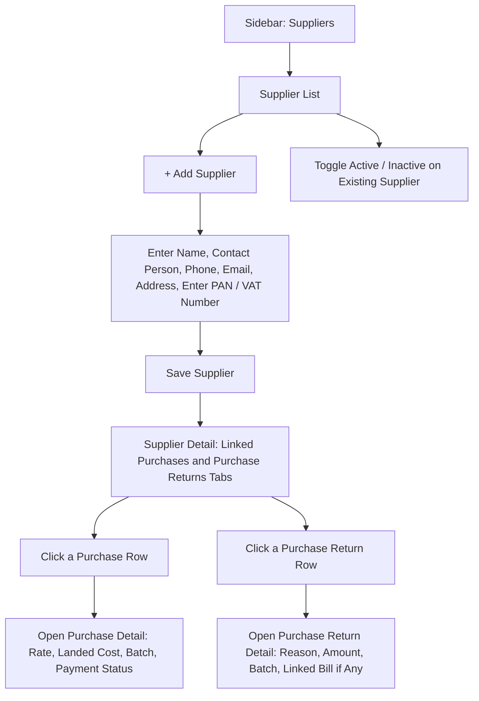

# CountIt — Supplier Management: UI Flow & Behavior

**Purpose of this document:** Show how supplier records are set up and linked to Purchase and Purchase Return activity, so the client can confirm the field set and activate/deactivate behavior match how they actually manage vendor relationships.

---
## 1. What the Spec Requires

- Supplier master data includes: **Name, Contact Person, Phone Number, Email, Address, PAN/VAT Number.**
- Users can **add, edit, activate, or deactivate** suppliers.
- **Purchase transactions** are linked to the respective supplier.
- **Purchase Returns** are linked to the respective supplier.

---

---

## 3. Step-by-Step UI Flow

### Walkthrough in plain language

1. **Supplier List (`/suppliers`)** — every supplier: Name, Contact Person, Phone, Active/Inactive status.
2. **+ Add Supplier** — enter core details: Name, Contact Person, Phone Number, Email, Address, and PAN/VAT Number (used for tax/import documentation).
3. **Save.** The Supplier Detail screen then accumulates every **Purchase** and **Purchase Return** linked to this supplier over time, shown as two lists (or tabs) on the same screen.
4. **Click into any Purchase row** from that list to open the full **Purchase Detail** screen for that bill — the same screen described in the Purchase Management document (supplier, currency, line items, additional charges, landed cost, batch number, payment status).
5. **Click into any Purchase Return row** to open the full **Purchase Return Detail** screen for that return — reason, returned amount, batch, and whether it referenced a bill (per the Purchase Return document).
6. **Activate/Deactivate** — a status toggle from the list or detail screen (Section 5 covers what deactivating should actually do).

---

## 4. Core Fields

|Field|Notes|
|---|---|
|Supplier Name||
|Contact Person|The individual point of contact at the supplier|
|Phone Number||
|Email||
|Address||
|PAN / VAT Number|Used for tax documentation on purchases|
|Status|Active / Inactive|

> **Needs a decision:** the spec lists a single Contact Person, Phone, and Email per supplier. For import suppliers in particular, it's common to deal with more than one contact (e.g. a sales contact and a shipping/logistics contact). **Confirm with the client** whether a single contact set is sufficient, or whether Supplier needs to support multiple named contacts.

---

## 5. Activate / Deactivate — Needs a Decision

The spec allows suppliers to be activated or deactivated, but doesn't say what that should actually do to existing data.

> **Needs a decision:** when a supplier is deactivated, should they simply **disappear from the supplier dropdown on new Purchase entries** (while all their historical purchases and purchase returns remain fully visible and untouched), or does deactivation need to do something further (e.g. block any further edits to past purchases tied to them)? Recommend the simpler behavior — hide from new-transaction dropdowns only, keep all history intact — but this hasn't been confirmed.

---

## 6. Linked Transactions

Supplier Detail should show, at minimum:

- **Purchase history** — every purchase bill raised against this supplier, with date, amount, and payment status.
- **Purchase Return history** — every return sent back to this supplier, with date, amount, and whether it referenced a bill.

This gives Internal Finance a full picture of the relationship with a given supplier without needing to cross-reference two separate module lists.

**Drill-down behavior:** both lists are clickable — selecting any row opens that transaction's own full detail screen, rather than just summarizing it inline on the supplier page:

|From Supplier Detail|Opens|
|---|---|
|Click a Purchase row|The full **Purchase Detail** screen for that bill (supplier, currency, raw material line items, additional charges, landed cost, batch number, payment status) — as described in the Purchase Management document|
|Click a Purchase Return row|The full **Purchase Return Detail** screen for that return (reason, returned amount/landed cost, batch, supplier link, and whether it referenced a bill) — as described in the Purchase Return document|

This keeps Supplier Detail itself as a clean summary/index, while the full transaction detail — including anything cost-sensitive — lives in its own screen, governed by that screen's own role visibility rules (Section 8 below still applies on top of this; Store Manager/Sales Team can't reach either detail screen even by drilling in from elsewhere).

---

## 7. Role Visibility

| Action                              | Org Admin | Internal Finance | Store Manager | Sales Team |
| ----------------------------------- | --------- | ---------------- | ------------- | ---------- |
| View Supplier List/Detail           | ✅         | ✅                | ❌             | ❌          |
| Create/Edit Supplier                | ✅         | ✅                | ❌             | ❌          |
| Activate/Deactivate Supplier        | ✅         | ✅                | ❌             | ❌          |
| View Linked Purchase/Return History | ✅         | ✅                | ❌             | ❌          |

> Mirrors the Purchase Management role table — supplier relationships are cost-side information, kept out of Store Manager and Sales Team's view, consistent with the hard rule established across every purchase-adjacent module.

---

