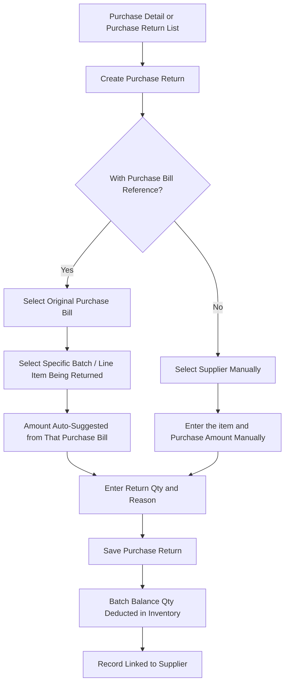

# CountIt — Purchase Return: UI Flow & Behavior

**Purpose of this document:** Show how stock gets sent back to a supplier — with or without an original purchase bill to reference — so the client can confirm the amount-suggestion logic and inventory effect match how returns to suppliers actually happen.

---
## 1. What the Spec Requires

- A Purchase Return is made whenever stock is sent back **to a supplier.**
- It can be created **with a purchase bill reference, or without one.**
- **Without a bill:** the purchase amount being returned is **entered manually.**
- **With a bill:** the purchase amount is **automatically suggested** from that original purchase bill.
- (From Supplier Management) every Purchase Return must be **linked to the respective supplier.**

---

## 2. Screens Involved

| Screen                 | Route                          | Status                                                                                                  |
| ---------------------- | ------------------------------ | ------------------------------------------------------------------------------------------------------- |
| Purchase Return List   | `/purchase-returns`            | ✅ Working (per Purchase Management document)                                                            |
| Purchase Return Create | `/purchase-returns/create`     | ✅ Working (per Purchase Management document) — but see Section 4 for a gap in what "amount" it suggests |
| Purchase Return Detail | `/purchase-returns/detail/:id` | ✅ Working (per Purchase Management document)                                                            |

> Status above is carried forward from the Purchase Management document, which already listed these three screens as working. Reconfirm against the frontend audit if this document is reviewed separately from that one.

---

## 3. Step-by-Step UI Flow

### Walkthrough in plain language

1. **Two entry points:** a Purchase Return can be started from an existing **Purchase Detail** screen (pre-linked to that bill, as already described in the Purchase Management document's "Need a Return?" step), or created fresh from the **Purchase Return List** when there's no bill to reference.
2. **With a bill:** select the original purchase, then the specific batch/line item being sent back. The system auto-suggests the amount (see Section 4 for exactly what that amount should be).
3. **Without a bill:** select the supplier manually, select the product/item and enter the purchase amount by hand, since there's no system record to pull it from.
4. **Enter the return quantity and a reason** (damaged, wrong item, wrong quantity, wrong attribute, etc.) either way.
5. **Save.** The returned quantity is deducted from that batch's Balance Qty in the Inventory ledger, and the record stays linked to the supplier for their transaction history.

---

## 4. Auto-Suggested Amount — Needs a Decision

The spec says the amount is "automatically suggested as per purchase bill," but Purchase Management already established that a purchased item's **landed cost** is more than its raw line-item rate — it also carries a proportional share of Freight, Insurance, TT/LC charges, Wages, and Transportation.

The client's own import cost worksheet shows this difference isn't small: a raw per-piece rate and its fully-loaded landed cost (after distributing freight, insurance, duty, and VAT) can differ substantially once every additional charge is spread across the bill.

> **Needs a decision:** should the auto-suggested return amount be the item's **raw purchase rate only**, or its **full landed cost** (rate + its share of every distributed additional charge)? Landed cost is the more accurate figure for what the business actually paid for that unit, but it also means the suggested amount will move if a return happens after the additional-charge distribution logic runs. Recommend using **landed cost**, since that's the true cost basis the business is recovering — but this hasn't been confirmed with the client.

---

## 5. VAT Reversal — Needs a Decision

Purchase Management lets each purchase mark **VAT Applied** and, separately, **VAT Claimable**. If VAT was claimed as an input credit on the original purchase and some of that stock is now being returned:

> **Needs a decision:** does a Purchase Return need to **reverse the proportional VAT credit** already claimed, or is that handled entirely outside CountIt (e.g. manually, by the accountant, at filing time)? This affects whether the Purchase Return form needs its own VAT-adjustment field or can stay silent on tax and leave it to Account Management.

---

## 6. Currency — Needs a Decision

If the original purchase was made in a foreign currency (per Multi-Currency Management), does the return amount get suggested in that **original transaction currency**, or converted to the **organization's base currency** using the exchange rate in effect at return time (which may differ from the rate at purchase time)?

> **Needs a decision.** This only becomes relevant once Multi-Currency is built, but worth deciding now since it affects the Purchase Return form's fields.

---

## 7. Batch & Inventory Effect

A Purchase Return always reduces the **same batch** the stock originally came in on — since Purchase Management already ties every item to the batch number generated at purchase, there's no ambiguity here the way there was with Sales Return (Approach A/B question). The returned quantity is deducted from that batch's Balance Qty, consistent with how Inventory Stock Maintenance already describes Purchase Return's effect on the ledger.

---

## 8. With Bill vs. Without Bill — Summary

|Feature|With Bill|Without Bill|
|---|---|---|
|Supplier|Auto-filled from the bill|Selected manually|
|Batch|Selected from the bill's line items|Entered manually (no system batch to reference, unless the business can still identify one)|
|Amount|Auto-suggested (see Section 4 for what "amount" means)|Entered manually|
|Typical use case|Normal returns shortly after a purchase|Old stock, or stock received before CountIt was in use|

---

## 9. Role Visibility

| Action                       | Org Admin | Internal Finance | Store Manager | Sales Team |
| ---------------------------- | --------- | ---------------- | ------------- | ---------- |
| View Purchase Returns        | ✅         | ✅                | ❌             | ❌          |
| Create Purchase Return       | ✅         | ✅                | ❌             | ❌          |
| View Suggested/Landed Amount | ✅         | ✅                | ❌             | ❌          |

> Mirrors the Purchase Management role table, since Purchase Return is the same cost-visibility-restricted territory as Purchase itself.

---

## 10. What's Confirmed vs. What Needs the Client's Answer

**Confirmed:** returns can be made with or without a bill reference; without a bill, amount is manual; the returned quantity deducts from the original batch; every return links to a supplier.

**Needs a decision:**

- Whether the auto-suggested amount is raw purchase rate or full landed cost — recommend landed cost (Section 4).
- Whether a proportional VAT credit reversal is needed on return (Section 5).
- Which currency a return amount is suggested/recorded in, once Multi-Currency is live (Section 6).
