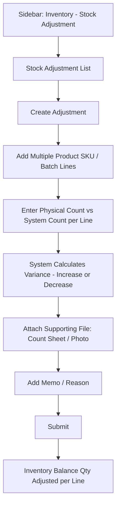

**Purpose of this document:** Show how the business corrects mismatches between physical and system stock — the memo-and-attachment workflow, and how this module's mention of "approved returns" relates to the Sales Return module — so the client can confirm this matches how stock discrepancies actually get reconciled.

---

## 1. What the Spec Requires

- Stock Adjustment is for **occasional tasks** to check, verify, and correct mismatches between **physical stock and system stock.**
- A **memo, with a file attachment**, covering **multiple product SKUs** and their **related inventory batch numbers**, is used to track and manage this.
- **Approved** returned or exchanged products should be added back to inventory with the appropriate batch number and stock quantity.

---
## 3. Step-by-Step UI Flow

### Walkthrough in plain language

1. **Stock Adjustment List** — every adjustment memo raised so far: Memo No, Date, Raised By, No. of Lines, Status.
2. **+ Create Adjustment ** — opens a form that can hold **multiple product SKU / batch lines** at once, since a real stocktake typically finds discrepancies across many items, not just one.
3. **For each line**, enter the **physical count** (what's actually on the shelf/in the safe) against the **system count** (what CountIt currently shows for that batch). The system works out the **variance** — positive if physical stock is higher than system stock (found extra), negative if lower (shrinkage, damage, loss, miscount).
4. **Attach a supporting file** — a photo, a signed count sheet, whatever backs up the discrepancy — per the spec's explicit mention of a file attachment.
5. **Add a reason** explaining the discrepancy.
6. **Submit.** The Inventory ledger's Balance Qty is adjusted per line to match the corrected figure.

---

## 4. Increase vs. Decrease

|Variance|Meaning|Example|
|---|---|---|
|Positive (+)|Physical count is higher than system count|Extra stock found, previously unrecorded|
|Negative (−)|Physical count is lower than system count|Shrinkage, damage, theft, miscount at an earlier stage|

Both directions post as an adjustment against the batch's Balance Qty — the spec doesn't distinguish different handling for the two beyond the memo/reason field, so both are treated the same way here structurally.

---

## 5. Role Visibility

| Action                 | Org Admin | Internal Finance | Store Manager | Sales Team |
| ---------------------- | --------- | ---------------- | ------------- | ---------- |
| View Stock Adjustments | ✅         | ✅                | ✅             | ❌          |
| Create Adjustment      | ✅         | ✅                | ✅             | ❌          |
| Attach Files           | ✅         | ✅                | ✅             | ❌          |

