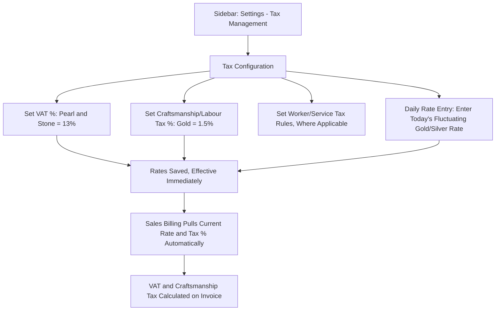

# CountIt — Tax Management: UI Flow & Behavior

**Purpose of this document:** Show how VAT and Craftsmanship/Labour Tax get configured and how they connect to the fluctuating daily gold/silver rate, so the client can confirm the tax rules and rate-entry process match how pricing actually moves day to day.

---
## 1. What the Spec Requires

- The system must maintain **taxable and non-taxable products.**
- **Pearls and Stones attract 13% VAT.**
- **Craftsmanship (Labour Tax) is calculated at 1.5% on Gold.**
- VAT percentage must be **configurable per product.**
- The system must support **worker/service tax calculation, where applicable.**
- Applicable taxes, including craftsmanship charges, must be **calculated automatically during billing**, based on the **manual entry of fluctuating rates.**
- Tax rates must be **configurable** to support future changes.

---
## 3. Step-by-Step UI Flow

### Walkthrough in plain language

1. **Tax Configuration (`/tax-settings`)** — where Org Admin/Internal Finance sets the base rules: VAT % on Pearl and Stone, Craftsmanship/Labour Tax % on Gold, and any Worker/Service Tax rules.
2. **Daily Rate Entry** — a separate, more frequently-used screen where the day's fluctuating gold/silver market rate is entered manually (Section 5 covers exactly what this feeds).
3. **Once saved**, these rates and percentages are what Sales Billing automatically pulls from — the sales person doesn't enter or calculate tax manually at the point of sale (per Sales Management and Billing Management).
4. **At billing**, VAT (on Pearl/Stone) and Craftsmanship Tax (on Gold) calculate automatically against whatever rate and percentage are currently in effect.

---

## 4. Tax Rules

| Rule                       | Applies To                         | Rate            |
| -------------------------- | ---------------------------------- | --------------- |
| VAT                        | Pearl and Stone value              | 13%             |
| Craftsmanship / Labour Tax | Gold value                         | 1.5%            |
| Worker/Service Tax         | "Where applicable" — see Section 6 | Not yet defined |

Both percentages must remain **configurable**, per the spec, so a future rate change doesn't require a code change — just an update on this screen.

---

## 5. The Fluctuating Rate — What It Actually Feeds

The spec says tax (including craftsmanship) is calculated "based on the manual entry of fluctuating rates." Given gold and silver market prices move daily, this almost certainly means: **someone manually enters today's gold/silver rate, and that entered rate becomes the value that Craftsmanship Tax (and possibly VAT, where it applies to metal-adjacent value) is calculated against.**

> **Needs a decision, and worth connecting to an already-open question:** the Production document separately flagged **"Making Charge"** (a production-cost element charged when converting raw gold into a finished item) as an open question with no defined structure. Both **Making Charge** and this module's **fluctuating rate entry** plausibly draw from the same real-world thing — the day's gold rate — but the spec describes them in two different modules (Production vs. Tax Management) without saying whether they're the same entry or two separate ones. **Confirm with the client:** is there **one shared "Today's Gold/Silver Rate" setting**, entered once and used by both Production (to cost a job) and Tax Management/Billing (to calculate craftsmanship tax) — or are these genuinely two separate rate entries serving two separate purposes? A single shared rate avoids the risk of the two figures drifting out of sync with each other.

> **Also needs a decision:** who enters this rate, and how often — once per day at open of business, or updated on demand whenever the market moves? This affects whether it's a simple daily-entry field or needs a rate history/log.

---

## 6. Worker/Service Tax — Needs Definition

The spec mentions this only as "where applicable," without describing what triggers it or how it's calculated.

> **Needs a decision:** what specific scenario does Worker/Service Tax apply to? Possibilities include outsourced production labor, third-party service work (e.g. repairs, engraving done by an external worker), or something else entirely. **Confirm with the client** before this can be given its own rule/rate structure — right now it can only be listed as a placeholder in the Tax Configuration screen.

---

## 7. Per-Product Override

Product Management already established that a product carries its own Tax% and a category-level default that a product can override. Tax Management is where those default percentages (13% VAT on Pearl/Stone, 1.5% Craftsmanship on Gold) are centrally configured — Product Management is simply where an individual product can be flagged as an exception if it genuinely needs a different rate than its category default. Neither document needs to duplicate the other's screen; Tax Management owns the rule/rate configuration, Product Management owns the per-product override flag.

---

## 8. Role Visibility

| Action                                      | Org Admin | Internal Finance | Store Manager | Sales Team |
| ------------------------------------------- | --------- | ---------------- | ------------- | ---------- |
| View Tax Configuration                      | ✅         | ✅                | ❌             | ❌          |
| Edit Tax %/Rules                            | ✅         | ✅                | ❌             | ❌          |
| Enter Daily Fluctuating Rate                | ✅         | ✅                | ❌             | ❌          |
| See Tax Applied on an Invoice (result only) | ✅         | ✅                | ✅             | ✅          |

> Configuration itself is Org Admin/Internal Finance only. Everyone involved in a sale can see the _calculated result_ (the tax line on an invoice), consistent with Sales Management, without being able to change the underlying rule or rate.

---

## 9. What's Confirmed vs. What Needs the Client's Answer

**Confirmed:** VAT 13% on Pearl/Stone, Craftsmanship Tax 1.5% on Gold; both configurable; tax calculates automatically at billing; per-product override lives in Product Management, not duplicated here.

**Needs a decision:**

- Whether the fluctuating rate entry here is the same shared rate used by Production's "Making Charge," or a separate entry (Section 5).
- Who enters the daily rate and how often (Section 5).
- What specifically triggers Worker/Service Tax, and its rate structure (Section 6).
