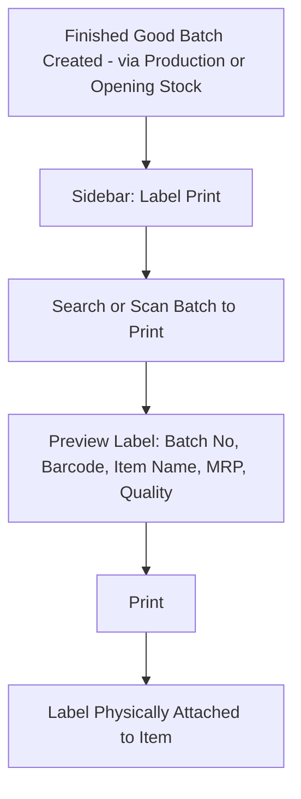
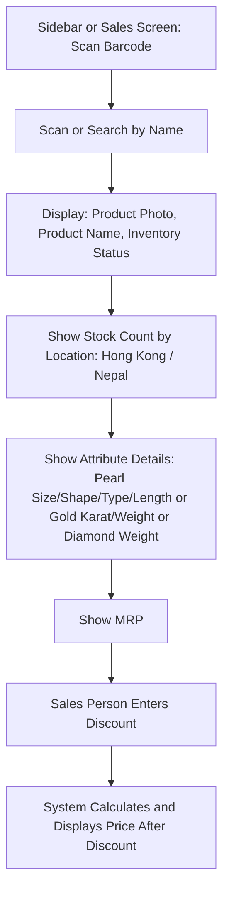

# CountIt — Label/Sticker Printing: UI Flow & Behavior

**Purpose of this document:** Show how a physical label gets printed and attached to a finished item, and — because the client's own reference sheet describes it — what happens when that label's barcode is scanned back into the system later, so the client can confirm both halves of this module match what actually happens on the shop floor.

**Source verified against:** CountIt Backend Specification (Label/Sticker Printing section) and the client's own `Barcode` reference sheet, which describes a scan-lookup screen not mentioned in the spec text at all.

---

## 1. What the Spec Requires

- Printing a label/sticker that carries: **Batch No, Bar Code, Item Name, MRP Price, Quality**, etc.
- This label is physically attached to a finished good before it can be sold.
---

## 2. Printing a Label

### Walkthrough in plain language

1. Once a finished-good batch exists (from Production, or from Opening Stock for pre-existing stock), it becomes eligible for a label.
2. **Search or scan the batch** to print for.
3. **Preview the label** — Batch No, the barcode itself, Item Name, MRP, and Quality (karat, for metal; or the relevant quality marker for the item type).
4. **Print**, and physically attach the label to the item.

### What the Barcode Actually Encodes

The client's own sheet is explicit on this point: **the barcode itself only references the Product** — it does not carry the label's other details (name, price, quality) baked into the code. Everything else on the printed label, and everything shown on scan, is **looked up live** from the system at print/scan time, not stored inside the barcode.

> **Needs a decision:** the client's Barcode table structure maps **Barcode → Product ID only**, with no batch reference. But the spec's own Label/Sticker requirement explicitly lists **Batch No** as something the label must show — and real batches of the same product can have genuinely different actual attributes (e.g. slightly different actual gold weight from one production run to the next). **Confirm with the client:** should the barcode itself encode the specific **batch**, not just the product — so that scanning two physically different pieces of the same SKU correctly shows each one's own batch-specific weight/details, rather than both showing identical generic product-level data? This seems necessary for the label to do what the spec asks (show batch-specific quality/weight), but it's a gap between the spec's requirement and the sheet's own table structure — not yet resolved.

---

## 4. Scanning a Barcode — Lookup Screen

This half comes entirely from the client's own reference sheet, not the spec text — flagged clearly since it's an addition, not a restatement.

### Walkthrough in plain language

1. **Scan the barcode**, or **search by product name** as an alternative (explicitly called for in the client's sheet).
2. The screen shows: **product photo, product name, Inventory Status (In-Stock / Backorder)**, and a **stock count split by location** — Hong Kong and Nepal specifically, per the client's sheet.
3. **Attribute details** display depending on item type — Pearl Size, Shape, Type, Length for pearl items; Gold Karat and Weight for metal items; Diamond Weight for stone items.
4. **MRP** displays.
5. The **sales person can enter a discount**, and the screen **calculates and shows the price after discount** live.

### Relationship to Sales Management's Discount Rule — Needs a Decision

Sales Management already established that **discount only applies to Pearl, Stone, and Wages/Labour value — never Gold/Silver metal value.** The Barcode sheet's discount feature doesn't restate that restriction; it just says "option for sales person to input discount."

> **Needs a decision:** does this scan screen's discount field follow the **same Pearl/Stone/Wages-only restriction** already established in Sales Management, or is it a simpler, unrestricted discount meant only as a quick customer-facing estimate (with the real, rule-following discount only being finalized inside the actual Sales/Billing flow)? Recommend keeping it consistent with the Sales Management rule, so a sales person doesn't get shown a discounted price on the scan screen that the system won't actually honor at checkout — but this hasn't been confirmed.

---

## 5. Role Visibility

| Action                        | Org Admin | Internal Finance | Store Manager | Sales Team |
| ----------------------------- | --------- | ---------------- | ------------- | ---------- |
| Print Labels                  | ✅         | ✅                | ✅             | ❌          |
| Scan / Look Up Product        | ✅         | ✅                | ✅             | ✅          |
| Enter Discount on Scan Screen | ✅         | ✅                | ✅             | ✅          |
| View MRP / Discounted Price   | ✅         | ✅                | ✅             | ✅          |
