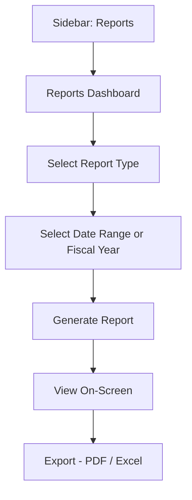

# CountIt — Reports: UI Flow & Behavior

**Purpose of this document:** Show the report catalog, date-range/fiscal-year filtering, and how this module relates to the reports separately required under Account Management, so the client can confirm the report list and access rules match what the business actually needs to see.

---
## 1. What the Spec Requires

- Reports are generated based on a **selected date range**, with a **fiscal year split.**
- Thirteen report types are required: **Inventory Report, Purchase Report, Sales Report, Customer Report (with purchase frequency and lifetime spend), Supplier Report, Product Pricing Report, Inventory Valuation Report, Tax Report, Backorder Report, Warehouse Report, Stock Movement Report, Client Dues Report, Delivery Status Report.**

---

## 2. Step-by-Step UI Flow

---

## 3. Report Catalog

|Report|What It Shows|Primarily Draws From|
|---|---|---|
|Inventory Report|Current stock levels across all batches|Inventory Stock Maintenance|
|Purchase Report|Purchase activity over the period|Purchase Management|
|Sales Report|Sales activity over the period|Sales Management|
|Customer Report|Per-customer purchase frequency and lifetime spend|Customer Management|
|Supplier Report|Per-supplier purchase/return activity|Supplier Management|
|Product Pricing Report|Selling/purchase price by product|Product Management|
|Inventory Valuation Report|Total stock value|Account Management|
|Tax Report|VAT and Craftsmanship Tax collected|Tax Management / Account Management|
|Backorder Report|Open backorders, split by Nepal/Hong Kong production origin|Backorder Management|
|Warehouse Report|Stock levels by warehouse/outlet|Warehouse/Store Management|
|Stock Movement Report|In/out transaction history|Inventory Stock Maintenance|
|Client Dues Report|Outstanding customer balances|Billing Management|
|Delivery Status Report|Invoice delivery status|Billing Management|

---

## 4. Date Range & Fiscal Year — Worth Raising

The spec calls for a "fiscal year split" specifically, not just a generic date picker. Given CountIt is being built for a Nepal-based business (multiple other documents in this set already reference Nepal-specific detail — NPR currency context, Nepal/Hong Kong as the two production origins), it's worth being explicit about one thing:

> **Worth raising with the client, not yet confirmed:** Nepal's own fiscal year does not follow the Jan–Dec calendar year — it runs roughly **mid-July to mid-July** (Shrawan to Ashad in the Bikram Sambat calendar). If reports need to split cleanly by fiscal year, the system likely needs a **configurable fiscal year start date**, not a hardcoded January 1st assumption. **Confirm with the client** what fiscal year boundary actually applies to their reporting.

---

## 5. Role Visibility

|Report|Org Admin|Internal Finance|Store Manager|Sales Team|
|---|---|---|---|---|
|Inventory Report|✅|✅|✅|❌|
|Purchase Report|✅|✅|❌|❌|
|Sales Report|✅|✅|✅|✅ (own sales only — see note)|
|Customer Report|✅|✅|✅|✅|
|Supplier Report|✅|✅|❌|❌|
|Product Pricing Report|✅|✅|❌|❌|
|Inventory Valuation Report|✅|✅|❌|❌|
|Tax Report|✅|✅|❌|❌|
|Backorder Report|✅|✅|✅|✅|
|Warehouse Report|✅|✅|✅ (own warehouse)|❌|
|Stock Movement Report|✅|✅|✅|❌|
|Client Dues Report|✅|✅|✅|✅|
|Delivery Status Report|✅|✅|✅|✅|

> **Flagging this whole table as an assumption, not a confirmed rule:** the spec only states role restriction explicitly for Account Management's financial reports ("only authorized users"). The breakdown above extends the cost-visibility pattern already established across every other module (Sales Team/Store Manager blocked from cost/purchase-side data) to each individual report, and gives Sales Team their own-sales-only view on the Sales Report as a reasonable default — but none of this per-report breakdown has been confirmed with the client and should be reviewed carefully before being built.

---
