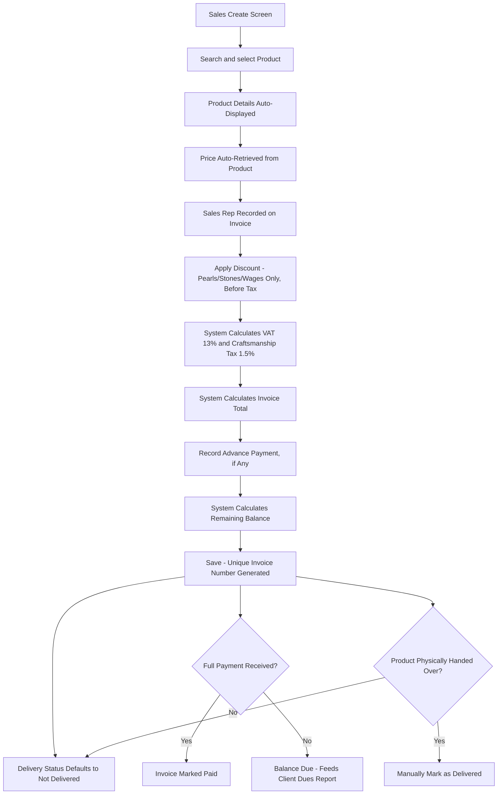

# CountIt — Billing Management: UI Flow & Behavior

**Purpose of this document:** Show exactly how an invoice's numbers get built — product lookup, price breakdown, discount/tax math, advance payment, and the separation between payment status and delivery status — so the client can confirm the invoice mechanics match what should actually print/display on a bill.

**Source verified against:** CountIt Backend Specification (Billing Management section), the client's own `Billing` reference sheet — which includes several details and at least one literally-unresolved internal note not present in the spec text at all — and the Sales Management document (which owns the customer/product/batch-selection front end this module's math sits behind).

---

## 1. What the Spec Requires

- Each sales transaction generates a **unique Invoice Number.**
- Billing allows **searching products by SKU.**
- **Product details auto-display** after a product is selected.
- **Product price auto-retrieves** from the system.
- **Discounts apply only to Pearls, Stones, and Labour/Wages** — never Gold or Silver.
- **Discounts apply before tax.**
- **VAT calculates automatically** based on product type.
- **Craftsmanship (Labour) Tax calculates automatically**, based on a manually entered rate.
- The invoice **automatically calculates the total.**
- Users can record **advance payments.**
- The system **automatically calculates the remaining balance** after an advance.
- The invoice is marked **Paid** once full payment is received.
- **Preparing an invoice does not automatically mark the product as delivered.**
- The system maintains each invoice's **delivery status.**
---

## 2. Step-by-Step UI Flow

### Walkthrough in plain language

1. **Search by Product SKU** — the primary lookup method named in the spec.
2. **Product details auto-display**, and **price auto-retrieves** — the sales person doesn't type in a price.
3. The **Sales Rep** processing the sale is recorded on the invoice (Section 6 — this comes from the client's sheet, not the spec text).
4. **Discount, if any**, applies only to Pearl/Stone/Wages value, calculated **before** tax.
5. **VAT and Craftsmanship Tax calculate automatically** (Section 7).
6. **Total calculates automatically.**
7. **Advance payment**, if the customer is paying part now, is recorded, and the **remaining balance** calculates automatically.
8. **Save** — a unique Invoice Number is generated.
9. **Delivery status** defaults to not-delivered and is tracked independently of payment (Section 9) — completing the invoice does not mean the item left the shop.
10. Once the customer pays the remaining balance in full, the invoice is marked **Paid.**

---

## 3. Invoice Number

Each sale gets a system-generated, unique Invoice Number at save time — used as the reference point for everything downstream: Sales Return, Backorder, Client Dues, and delivery tracking all link back to this number.

---

## 4. Discount, VAT, and Craftsmanship Tax

|Rule|Applies To|Rate / Timing|
|---|---|---|
|Discount|Pearls, Stones, Wages/Labour only — never Gold or Silver|Applied before tax|
|VAT|Pearl and Stone value|13%|
|Craftsmanship / Labour Tax|Gold value only|1.5%, based on the currently entered fluctuating rate (see Tax Management document)|

This table restates, rather than re-derives, the rule already established in Sales Management and Tax Management — included here only because Billing is where the actual invoice-line math is finalized and printed.

---

## 5. Advance Payment, Balance, and the "Paid" Status

- An **advance payment** can be recorded at the time the invoice is prepared.
- The system calculates the **remaining balance** automatically (Total − Advance).
- Once the customer pays the rest, the invoice becomes **Paid.**
- The client's own notes add one more operational detail not in the spec text: **a Client Dues Report should be produced every 15 days**, listing outstanding balances.

---

## 6. Delivery Status — Deliberately Independent of Payment

Per spec, explicitly: **preparing an invoice does not mark the product as delivered.** These are two separate states tracked on the same invoice:

|State|Meaning|Set By|
|---|---|---|
|Payment Status|Unpaid / Partially Paid (advance recorded) / Paid|Automatic, based on advance + balance math|
|Delivery Status|Not Delivered / Delivered|Manual action — someone marks it once the item is actually handed over|

A fully paid invoice can still be undelivered (item being sized, cleaned, or simply not yet picked up), and a delivered item doesn't have to be fully paid (e.g. store credit terms) — the two are tracked independently, matching the spec's explicit instruction.

---

## 7. Role Visibility

|Action|Org Admin|Internal Finance|Store Manager|Sales Team|
|---|---|---|---|---|
|Create Invoice|✅|✅|✅|✅|
|View Price Breakdown / Tax Math|✅|✅|✅|✅|
|Record Advance Payment|✅|✅|✅|✅|
|Mark Invoice Paid|✅|✅|✅|✅|
|Mark as Delivered|✅|✅|✅|❌|
|View Client Dues Report|✅|✅|✅|✅|

> Consistent with Sales Management — this is customer-facing, sales-floor territory, not cost-restricted like Purchase.
