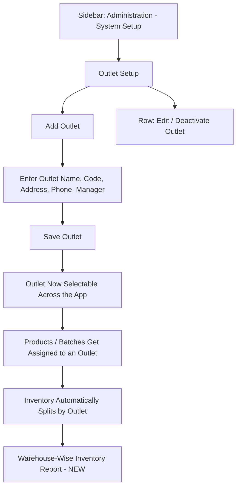

# CountIt — Warehouse / Store Management: UI Flow & Behavior

**Purpose of this document:** Show how outlets/warehouses are set up and how inventory is kept separate per location, so the client can confirm the multi-outlet structure matches how the business actually operates across its physical locations.

---

## 1. What the Spec Requires

- **Multiple warehouses/outlets** should be supported.
- **Inventory should be maintained warehouse-wise** — not as one combined pool across the whole business.
- **Stock transfer between outlets** can be made (full detail in the separate Stock Transfer document).
- **Warehouse-wise inventory reports** should be available.

---

## 3. Step-by-Step UI Flow

### Walkthrough in plain language

1. **Outlet Setup (`/outlet-setup`)** — a table of every outlet: Outlet Name, Code, Address, Phone, Manager, Status.
2. **Click `+` to add an outlet** — enter its name, a short code, address, phone number, and assign a manager.
3. **Save.** From this point on, the outlet becomes a selectable location everywhere else in the app that needs one — Purchase (which outlet received the stock), Sales Billing (which outlet is selling), Stock Transfer (from/to), Production (which outlet's raw materials are being consumed).
4. **Inventory naturally splits by outlet** once products/batches are tied to a specific location — the same product SKU can show different available quantities at different outlets.
5. **Row actions:** Edit outlet details, deactivate an outlet that's closed. **Note:** per the existing role rules, a Store Manager can only edit their own outlet, not every outlet in the list.
6. **Warehouse-Wise Inventory Report** _(needs to be built)_ — the natural next step once outlet-tagged inventory exists: a report that filters or breaks down Stock Summary/Inventory Summary by outlet, so someone can answer "how much of this product do we have at the Thamel outlet specifically?"

---

## 4. Outlet Setup vs. Master Outlet — Needs Clarification

Two separate outlet-management screens exist in the current build:

- **Outlet Setup (`/outlet-setup`)** — everyday outlet management, presumably scoped to a single organization/tenant.
- **Master Outlet (`/master-outlet`)** — SuperAdmin-only, which suggests it's a cross-organization view (relevant if CountIt is used by more than one jewellery business as separate tenants on the same platform).

> **Needs a decision:** confirm this split is intentional (Master Outlet = platform-level oversight across all client organizations; Outlet Setup = this specific business's own outlets) rather than two overlapping screens doing the same thing. If CountIt is only ever used by this one business, Master Outlet may not be relevant to this client at all and could be excluded from their scope.

---

## 5. Role Visibility

|Action|Org Admin|Internal Finance|Store Manager|Sales Team|
|---|---|---|---|---|
|View Outlet List|✅|✅|✅|❌|
|Create/Edit Any Outlet|✅|❌|❌|❌|
|Edit Own Outlet Only|✅|❌|✅|❌|
|View Warehouse-Wise Inventory Report _(new)_|✅|✅|✅|❌|

---

