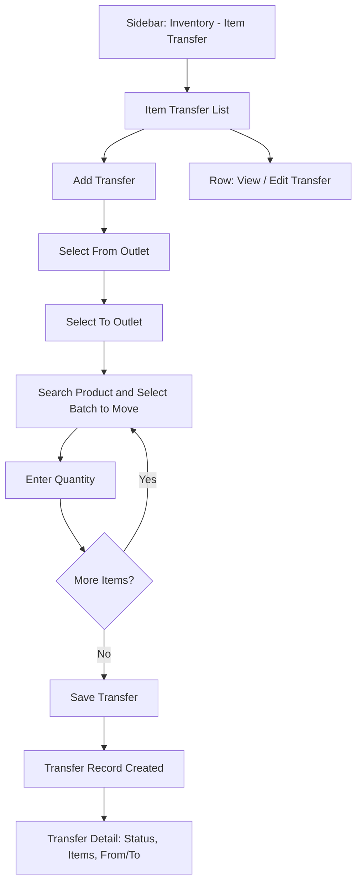

# CountIt — Stock Transfer: UI Flow & Behavior

**Purpose of this document:** Show how stock physically moves between outlets in CountIt — what a person clicks to send inventory from one location to another, and what happens on the receiving end — so the client can confirm this matches how outlet-to-outlet transfers actually work.

---
## 1. What the Spec Requires

- **Stock transfer between outlets can be made.**

This is the entire spec line for this module — short by design, but it sits on top of everything else already documented (batch tracking, Pearl/Metal/Stone attributes, multi-outlet support), so this document fills in the practical detail the one-line spec doesn't spell out.

---
## 2. Step-by-Step UI Flow

### Walkthrough in plain language

1. **Item Transfer List (`/item-transfer`)** — a table of every transfer: From Outlet, To Outlet, Date, Status.
2. **Click `+` to start a transfer** — opens Item Transfer Create.
3. **Select the From Outlet and To Outlet.**
4. **Add products** — search by SKU/name, then select the **specific batch** being moved (not just "10 units of this product" — the exact batch, since a batch carries its own attribute values and cost history that must travel with it).
5. **Enter the quantity** to move from that batch, and repeat for as many products/batches as the transfer includes.
6. **Save.** The transfer is recorded, and the item(s) are logged as moving from one outlet's inventory to the other's.
7. **Item Transfer Detail** — shows the full record: items, batches, quantities, from/to outlets, and current status.

---

## 3. Role Visibility

|Action|Org Admin|Internal Finance|Store Manager|Sales Team|
|---|---|---|---|---|
|View Transfers|✅|✅|✅|❌|
|Create/Edit Transfer|✅|✅|✅|❌|
|Confirm Receipt _(if two-step is adopted)_|✅|✅|✅ (own outlet only)|❌|

> Store Manager involvement here matters more than in most cost-restricted modules, since a Store Manager is often the person physically present when stock arrives at their outlet — worth confirming they should be the one able to confirm receipt at their own location specifically (not other outlets).

---

