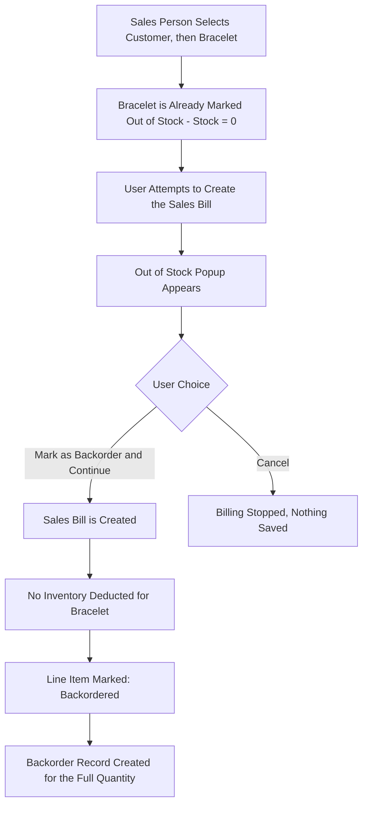
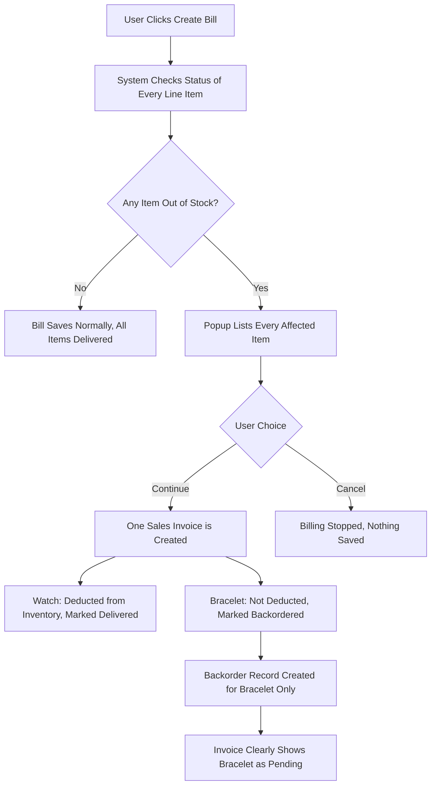
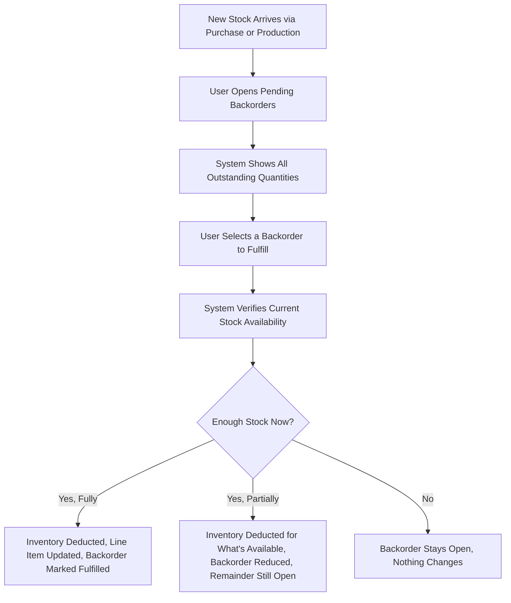

# CountIt — Backorder Management: UI Flow & Behavior

**Purpose of this document:** Show exactly how CountIt handles a sale that includes an item that isn't in stock — down to the level of a single line item on a single bill — so the client can confirm this matches how partial availability is actually meant to work at the counter.

**Source verified against:** CountIt Backend Specification (Backorder Management section) and the client's own Backorder logic requirements (line-item-level handling), cross-checked against the client's Backorder data sheet.

---

## 1. What the Spec Requires

- The system must support **backorders for unavailable products.**
- Every backorder is **linked to the original Sales Invoice.**
- Users record an **expected completion date** and the **customer's required delivery date.**
- The system **tracks delivery status.**
- **Backorder reports** must be available, split by **Nepal or Hong Kong** production origin.

---

## 2. The Core Rule: Backorder Lives at the Line-Item Level, Not the Whole Bill

This is the single most important design decision in this module, and it changes the shape of everything below it:

> **A backorder status belongs to one product line on a bill — not to the entire bill.** One sales bill can freely contain a mix of items that are delivered immediately and items that are backordered. The bill itself is never simply "backordered" or "not backordered" as a whole; each line item carries its own status.

This is why a customer can walk out with the two items you have in stock today, while a third item on the very same invoice is still being sourced.

---

## 3. How "Out of Stock" Gets Detected

A product's stock is tracked continuously, not just checked at the moment of billing. **Once a product's available quantity reaches 0, it is marked Out of Stock** — this is a standing status on the product/batch itself, the same way any other stock level is shown, not something calculated only when someone tries to sell it.

**What this means during Sales Billing:** when the sales person searches for and selects a product, the system already knows whether it's Out of Stock before the bill is even created — the product's current stock status is right there in the product search result. The **Out of Stock dialog** (Section 5) simply surfaces this already-known status at the moment it matters: when the user tries to add that product to the bill or save the bill.

**Worked example:** Bracelet has a stock quantity of 0 → it is marked **Out of Stock**. A sales person selects the Customer, then selects Bracelet, then attempts to create the sales bill — the system shows the Out of Stock popup described below. It isn't running a fresh availability check from scratch; it's acting on the status the product already carries.

---
## 5. Scenario 1 — A Single-Item Bill, Fully Out of Stock

The simplest case: one product on the bill, and none of it is available.



**Example result:**

|Product|Qty|Status|
|---|---|---|
|Bracelet|1|Backordered|

---

## 6. Scenario 2 — A Multi-Item Bill, Mixed Availability

The more common real-world case: some items on the bill are in stock, others aren't.

**Example input:**

|Product|Requested Qty|Stock|Status|
|---|---|---|---|
|Bracelet|1|0|Out of Stock|
|Watch|1|5|Available|



**The popup shown to the user:**

> Some items are unavailable.
> 
> - Bracelet ×1 → Out of Stock (will be backordered)
> - Watch ×1 → Available
> 
> Continue with a partial fulfillment? **[Continue]** **[Cancel]**

**If the user continues:**

- **One** Sales Invoice is created — not two separate bills.
- Watch is deducted from inventory.
- Bracelet is **not** deducted.
- A Backorder record is created for Bracelet.
- The invoice itself clearly indicates that Bracelet is still pending, right alongside the items that were delivered.

**What the resulting invoice looks like:**

```
Invoice #1001
✓  Watch        Qty 1    Delivered
⏳  Bracelet     Qty 1    Backordered

Total: Rs. XXXX
```

This is the key detail worth highlighting to the client: the invoice is **not** hidden away or split into two documents — one invoice, with each line clearly marked as either fulfilled or pending, so the customer and the sales person both see the full picture on one printed or on-screen bill.

---

## 7. Partial Quantity — When Some, But Not All, of the Requested Amount Is Available

The system must also handle a requested quantity that's only _partly_ covered by stock on hand.

**Example input:**

|Product|Ordered|Available|
|---|---|---|
|Bracelet|10|6|

**What happens:** the bill delivers the 6 units that are available, and a backorder is automatically created for the remaining 4 — both against the **same line item**.

**Example result:**

|Product|Ordered|Delivered|Backordered|
|---|---|---|---|
|Bracelet|10|6|4|

This means a single line item can carry three numbers at once — how much was ordered, how much actually went out the door, and how much is still owed — rather than being a strict either/or between "Delivered" and "Backordered."

---

## 8. Fulfilling a Backorder Later

When new stock comes in (via Purchase or Production), pending backorders need a way to get closed out.



**Walkthrough in plain language:**

1. Open the **Pending Backorders** view (a filtered state of the Backorder List — see Section 10).
2. Every outstanding backordered quantity is shown, tied back to its original invoice and line item.
3. Select one to fulfill.
4. The system checks whether there's now enough stock. If yes, it deducts inventory and marks that backorder fulfilled (updating the original line item's status — e.g., Bracelet on Invoice #1001 flips from ⏳ Backordered to ✓ Delivered). If only some of the outstanding quantity can now be covered, it fulfills what it can and leaves the rest open, still backordered.

---

---

## 11. Fields (Updated for Line-Item-Level Tracking)

| Field               | Meaning                                                                       |
| ------------------- | ----------------------------------------------------------------------------- |
| Date                | When the backorder was raised                                                 |
| Invoice No.         | Link to the originating Sales Invoice                                         |
| Line Item / Product | Which specific line on that invoice this record belongs to                    |
| Ordered Qty         | The quantity originally requested on this line                                |
| Delivered Qty       | How much of that quantity has actually gone out                               |
| Backordered Qty     | What's still outstanding (Ordered − Delivered)                                |
| Expected Date       | When production/import expects the item to be ready                           |
| Client Date         | When the customer needs/expects it                                            |
| Delivered Date      | Date the outstanding quantity was actually fulfilled (blank while still open) |

---

## 13. Role Visibility

|Action|Org Admin|Internal Finance|Store Manager|Sales Team|
|---|---|---|---|---|
|Create Backorder — Path A (inline from Sales)|✅|✅|✅|✅|
|Create Backorder — Path B (standalone, after the fact)|✅|✅|✅|❓ _(see below)_|
|View Backorder List/Detail|✅|✅|✅|✅|
|Fulfill a Backorder|✅|✅|✅|❌|
|View/Generate Nepal or HK Report|✅|✅|✅|❌|
