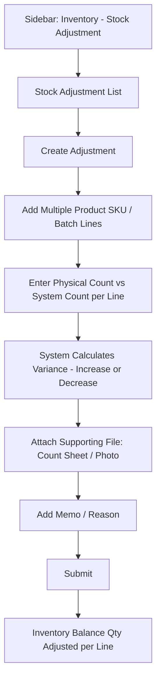

# CountIt — Stock Adjustment: UI Flow & Behavior

**Purpose of this document:** Show how the business corrects mismatches between physical and system stock — the memo-and-attachment workflow, and how this module's mention of "approved returns" relates to the Sales Return module — so the client can confirm this matches how stock discrepancies actually get reconciled.

---

## 1. What the Spec Requires

- Stock Adjustment is for **occasional tasks** to check, verify, and correct mismatches between **physical stock and system stock.**
- A **memo, with a file attachment**, covering **multiple product SKUs** and their **related inventory batch numbers**, is used to track and manage this.
- **Approved** returned or exchanged products should be added back to inventory with the appropriate batch number and stock quantity.

---
## 3. Step-by-Step UI Flow

### Walkthrough in plain language

1. **Stock Adjustment List** — every adjustment memo raised so far: Memo No, Date, Raised By, No. of Lines, Status.
2. **+ Create Adjustment Memo** — opens a form that can hold **multiple product SKU / batch lines** at once, since a real stocktake typically finds discrepancies across many items, not just one.
3. **For each line**, enter the **physical count** (what's actually on the shelf/in the safe) against the **system count** (what CountIt currently shows for that batch). The system works out the **variance** — positive if physical stock is higher than system stock (found extra), negative if lower (shrinkage, damage, loss, miscount).
4. **Attach a supporting file** — a photo, a signed count sheet, whatever backs up the discrepancy — per the spec's explicit mention of a file attachment.
5. **Add a memo/reason** explaining the discrepancy.
6. **Submit.** The Inventory ledger's Balance Qty is adjusted per line to match the corrected figure.

---

## 4. Increase vs. Decrease

|Variance|Meaning|Example|
|---|---|---|
|Positive (+)|Physical count is higher than system count|Extra stock found, previously unrecorded|
|Negative (−)|Physical count is lower than system count|Shrinkage, damage, theft, miscount at an earlier stage|

Both directions post as an adjustment against the batch's Balance Qty — the spec doesn't distinguish different handling for the two beyond the memo/reason field, so both are treated the same way here structurally.

---

## 5. Relationship to Sales Return's "Approved" Wording — Needs a Decision

This is the most important open question in this document, and it was already flagged from the other side in the Sales Return document (Section 5): the spec's Sales Return section says returned items are added back to inventory **"after validation,"** while this module's spec section separately says **"approved"** returned/exchanged products go back to inventory with batch details. Two readings are possible:

**Approach A — Stock Adjustment is unrelated to Sales Return's approval.** This module exists purely for physical-vs-system stocktake corrections. The "approved returned or exchanged products" line here is just descriptive cross-reference — restating that returns/exchanges are also an inventory-affecting event, tracked the same way (batch number, quantity) as any other stock movement — not an instruction that returns must be routed through this screen or approved here.

**Approach B — Stock Adjustment is the approval gate for Sales Return.** A return or exchange, once created in Sales Return, sits in a pending state, and only becomes a real inventory change once someone approves it through this module's memo/approval workflow — meaning Sales Return's "after validation" and this module's "approved" are describing the same single step, just from two different spec sections.

**Recommended default: Approach A.** The Sales Return spec section describes its own complete flow (return → fee calculated → validated → added to inventory) without mentioning a handoff to a separate module, which suggests "validation" and "approval" are being used loosely to mean the same self-contained check within Sales Return itself, and this module's line is simply reiterating that returns fall into the same inventory-tracking category as adjustments. But this is a judgment call, not a certainty — **confirm with the client**, since it changes whether Sales Return needs its own approval step/role, or whether every return has to additionally pass through a Stock Adjustment memo before stock is restored.

---

## 6. Does Stock Adjustment Itself Need Approval? — Needs a Decision

Separately from the question above: for a straightforward stocktake correction (not related to returns at all), does the memo take effect **immediately on submission**, or does it need a **second person to approve it** before the Inventory ledger actually changes? The spec doesn't say either way.

> **Needs a decision.** A two-step raise-then-approve workflow is common for stock adjustments generally (since they can be used to cover up shrinkage/theft if unchecked), but this hasn't been confirmed. If required, this would add a Pending/Approved/Rejected status to the memo and a role that can approve it.

---

## 7. Role Visibility

|Action|Org Admin|Internal Finance|Store Manager|Sales Team|
|---|---|---|---|---|
|View Stock Adjustments|✅|✅|✅|❌|
|Create Adjustment Memo|✅|✅|✅|❌|
|Approve Adjustment (if approval step applies — Section 6)|✅|✅|❓ pending Section 6 decision|❌|
|Attach Files|✅|✅|✅|❌|

---

## 8. What's Confirmed vs. What Needs the Client's Answer

**Confirmed:** memo-based, multi-line, multi-batch structure; file attachment requirement; variance can go either direction (+/−).

**Needs a decision:**

- Whether this module is the approval gate for Sales Return, or entirely separate — see Section 5 (recommend treating them as separate/Approach A, but this is a judgment call, not a confirmed answer).
- Whether Stock Adjustment memos themselves need a raise-then-approve workflow, or take effect immediately on submission (Section 6).
